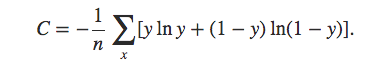

# 全文总结

## 第一章总结

- 第1小节: 后端服务搭建

  - 学习了后端服务在整个系统中的主要作用：

    - 封装所有的文本处理环节，对外提供可以调用的API，让其他部门的同事或者不了解内部细节的人员都可以使用。

    ------

  - 学习并实现了搭建并启动一个完整的django服务框架四步曲。

  ------

  - 学习并实现了使用服务内部的三个python文件运行一个请求的demo的三步曲。

------

- 第2小节: 输入预处理

  - 学习了输入预处理在整个系统中的作用:
    - 保证用户输入的合理性，避免系统因为接受异常数据而过载。

  ------

  - 学习并实现了输入预处理的三步曲。

------

- 第3小节: 图谱匹配

  - 学习了什么是标签词汇图谱:
    - 它是由标签节点和词汇节点以及节点之间的边组成的一张树状图。

  ------

  - 学习了图谱匹配在整个系统中的作用：
    - 通过匹配词汇召回所有可能的标签。

  ------

  - 学习并实现了图谱匹配的过程。

------

- 第4小节: 匹配歧义判断

  - 学习了什么是匹配歧义:
    - 在图谱匹配过程中，一个词汇可能一起匹配到多个标签，这时说明我们的词汇出现了歧义现象，这就是匹配歧义。

  ------

  - 学习了匹配歧义判断在整个系统中的作用：
    - 在词汇出现歧义时，通过模型重新计算所属标签的概率，从语义层面获得更真实的标签概率。

  ------

  - 学习并实现了匹配歧义判断的过程。

------

- 第5小节: 概率调整

  - 学习了概率调整在整个系统中的作用:
    - 保证随着某一类别词汇出现的次数增多，这个类别的概率会随之增加。

  ------

  - 学习并实现了图谱匹配的过程。

------

- 第6小节: 概率归一化与父标签检索

  - 学习了概率归一化在整个系统中的作用:
    - 使标签概率的结果在（0到1）的概率值域内。

  ------

  - 学习了父标签检索在整个系统中的作用:
    - 找到当前标签的父标签列表，丰富系统的返回结果。

  ------

  - 学习并实现了概率归一化与父标签检索的过程。

------

## 第二章总结

- 第1小节: 设计标签树

  - 学习了设计标签树过程的三步曲:

    - 第一步: 明确设计原则。
    - 第二步: 确定一级和二级标签。
    - 第三步: 标签树存储。

    ------

    - 学习了明确设计原则: * 业务导向原则 * 最小可行化原则

    ------

    - 学习了确定一级和二级标签。

    ------

    - 学习了标签存储: * 必须使用扁平化的存储结构。

------

- 第2小节: 构建标签树
  - 学习并实现了构建标签树的四步曲:
    - 第一步: 删除之前的与标签相关的节点和边。
    - 第二步: 遍历标签结构列表中的每一个字典。
    - 第三步: 遍历字典中的每一组key和value，根据key，MERGE每一个等级的父标签节点。
    - 第四步: 遍历value列表，创建每一个等级的子标签节点及其关系。

------

- 第3小节: 获取原始数据

  - 学习了原始数据来源:
    - 公司作为内容生产商，有各种类型内容的生产小组，提供各种文本语料。

  ------

  - 学习了原始数据样式。

    ------

  - 学习了原始数据的基本属性。

------

- 第4小节: 获取词汇集
  - 学习并实现了获取词汇集过程的三步曲:
    - 第一步: 读取原始数据到内存。
    - 第二步: 获取句子中的名词并进行长度过滤。
    - 第三步: 将词汇写入到csv文件之中。

------

- 第5小节: 将词汇集导入图谱
  - 学习并实现了将词汇集导入图谱过程三步曲:
    - 第一步，删除所有与词汇节点及其相关的边
    - 第二步，遍历labels文件夹下的词汇csv文件。
    - 第三步，遍历csv文件中的每一个词汇创建节点，并与对应的标签建立关系。

------

## 第三章总结

- 第1小节: 获取训练语料

  - 学习了获取训练语料过程的三步曲:
    - 第一步： 明确原始数据来源。
    - 第二步： 定义正负样本。
    - 第三步： 提取正负样本语料。

  ------

  - 学习了明确原始数据来源:
    - 公司内容生产小组提供的各种类型的文章。

  ------

  - 学习了定义正负样本:
    - 将文章中的每一条句子作为该类别的正样本； 将其他类别文章中的每一条句子作为负样本。

  ------

  - 学习并实现了提取正负样本:
    - 先提取正样本语料，再在正样本基础上，提取正负样本语料。

------

- 第2小节: 进行数据分析

  - 学习了数据分析过程的四步曲:
    - 第一步: 获取正负样本的分词列表和对应的标签。
    - 第二步: 获取正负标签数量分布。
    - 第三步: 获取句子长度分布。
    - 第四步: 获取常见词频分布。

  ------

  - 学习并实现了获取正负样本的分词列表和对应的标签。
    - 作用: 为进行可视化数据分析作数据准备。

  ------

  - 学习并实现了获取正负标签数量分布。
    - 作用: 用于帮助调整正负样本比例。

  ------

  - 学习并实现了获取句子长度分布。
    - 作用: 用于帮助判断句子合理的截断长度。

  ------

  - 学习并实现了获取常见词频分布。
    - 作用: 指导之后模型超参数max_feature的选择和初步评估数据质量。

------

- 第3小节: 特征处理

  - 学习了特征处理过程的四步曲:
    - 第一步: 进行词汇映射
    - 第二步: 将向量进行合适截断
    - 第三步: 加入n-gram特征
    - 第四步: 将向量进行最长补齐

  ------

  - 学习并实现了进行词汇映射:
    - 作用: 将分词列表中的每个词映射成数字。

  ------

  - 学习并实现了将向量进行合适截断:
    - 作用: 将映射后的句子向量进行截断，以降低模型输入的特征维度，来防止过拟合。

  ------

  - 学习并实现了加入n-gram特征:
    - 作用: 将n-gram表示作为特征，能够补充特征中没有上下文中关联的缺点，将有效帮助模型捕捉上下文的语义关联。

  ------

  - 学习并实现了将向量进行最长补齐:
    - 作用: 为了不损失n-gram特征，使向量能够以矩阵形式作为模型输入。

------

- 第4小节: 构建模型结构

  - 学习了模型结构中三个重要的层:
    - Embedding层
    - GAP层(全局平均池化层)
    - Dense + sigmoid层

  ------

  - 学习了Embedding层:
    - 层结构: 结构可以看作是一个矩阵，它的大小是语料的有效词汇总数(max_features)乘以我们预定义的embedding_dims，这个矩阵就相当于是由每一个特征拓展成embedding_dims后的表示。
    - 层参数: 矩阵中的每一个数，一般模型需要求解的参数，因此Embedding层的参数总量是max_features x embedding_dims。
    - 输入参数: max_features即最大特征数, embedding_dims即词嵌入维度, input_length即句子的最大长度。
    - 输入形状: [None, input_length]
    - 输出形状: [None, input_length, embedding_dims]
    - 作用: 用向量表示每一个特征，在更高维度的映射空间捕捉词与词之间的关系。

  ------

  - 学习了GAP层:
    - 层结构: 本质上是对矩阵的一种计算方法，无结构。
    - 层参数: 无
    - 输入参数: 无
    - 输入形状: [None, input_length, embedding_dims]
    - 输出形状: [None, embedding_dims]
    - 作用: 消减模型参数总量，防止过拟合。

  ------

  - 学习了Dense + sigmoid层:
    - 层结构: 具有个1个节点的一层全连接网络，最后的激活函数使用sigmoid。
    - 层参数: 该节点中的w向量共50维，加上一个偏置b，共51个参数。
    - 输入参数: 分别是该层的节点数以及使用的sigmoid函数。
    - 输入形状: [None, embedding_dims]
    - 输出形状: [None, 1]
    - 作用: 将抽象的特征表示归一到指定的类别上，能够输出我们想要的0或者1的结果。

  ------

  - 学习并实现了使用上面三个层构建fasttext模型。

------

- 第5小节: 选取损失函数和优化方法

  - fasttext模型选取的损失函数:

    - 二分类交叉熵损失函数

    ------

  - fasttext模型选取的优化方法:

    - Adam

  ------

  - 二分类交叉熵损失:
    - 作用: 用于描述模型预测值与真实值的差距大小。
    - 形式: 
    - 优势: 作为一种优化后的损失函数，能够避免均方误差损失的在处理sigmoid函数时收敛到趋于1时，梯度非常平缓，又因为使用的优化方法往往基于梯度下降，所以出现”学习迟缓”的现象。为了避免该现象，交叉熵的形式应运而生。

  ------

  - Adam优化方法:
    - 作用: 求损失函数最优解的方法。
    - 优势: 结合Adagrad与RSMProp的算法特点， 对梯度的一阶矩估计（即梯度的均值）和二阶矩估计（即梯度的未中心化的方差）进行综合考虑，计算出更新步长. 学习率可自由调节。
    - 学习并实现了在模型中选取损失函数与优化方法。

------

- 第6小节: 进行模型训练

  - 学习了实现模型训练和绘制准曲率和损失对照曲线的过程。

  ------

  - 学习了通过准确率对照曲线判断过拟合：
    - 当训练准确率上升而验证准确率开始平缓或下降时，在这个点处开始出现过拟合现象。

  ------

  - 学习了如何防止过拟合:
    - 通过对比验证集与训练集准确曲线，在验证acc不在上升的轮数时停止训练。

------

- 第7小节: 模型保存与加载
  - 学会了实现模型保存与加载的过程。

------

## 第四章总结

- 第一小节: 多模型多进程训练

  - 学习了使用多进程的原因:
    - 在python这门语言中，存在一个全局解释锁，它使系统的多个线程无法一同使用CPU资源，对于计算密集型任务，必须采用多进程方式并行化，而我们的模型训练，正是最典型的计算密集型任务，里面涵盖大量的矩阵计算，因此，我们这里使用多进程训练。

  ------

  - 学习了多模型多进程的训练逻辑：
    - 开启第一个模型训练进程，进入训练状态后开始检测占用资源是否小于CPU/内存正常负载值。小于CPU/内存正常负载值，则开启第二个模型训练任务。否则，开始检测占用资源是否大于CPU/内存危险负载值，如果大于，则kill掉这个进程，否则，说明占用率处在正常负载值与危险负载值之间，此时，等待该模型训练进程结束，再自动开启下一个模型训练进程。

------

- 第二小节: 多模型多线程预测
  - 学习并实现了多模型多线程预测的三步曲:
    - 第一步: 将h5格式的模型转化成pb格式。
    - 第二步: 使用docker启动tensorflow-serving微服务。
    - 第三步: 多线程调用微服务并处理结果。

------

## 第五章总结

- 第一小节: 系统联调与测试

  - 学习并实现系统联调与测试过程的三步曲:
    - 第一步: 明确系统处理请求的五个环节。
    - 第二步: 将这五个环节实现在django服务的views.py函数中。
    - 第三步: 使用测试脚本进行测试。

  ------

  - 学习了明确系统处理请求的五个环节:
    - 输入预处理
    - 图谱匹配
    - 匹配歧义判断
    - 概率调整
    - 概率标签化与父标签检索

------

- 第二小节: 搭建前端可视化页面
  - 学习并实现了搭建一个前端可视化页面的三步曲:
    - 第一步：使用bootstrap3搭建一个可视化页面。
    - 第二步：使用jquery向后端发送ajax请求并显示结果。
    - 第三步: 在页面中输入文本进行请求测试。