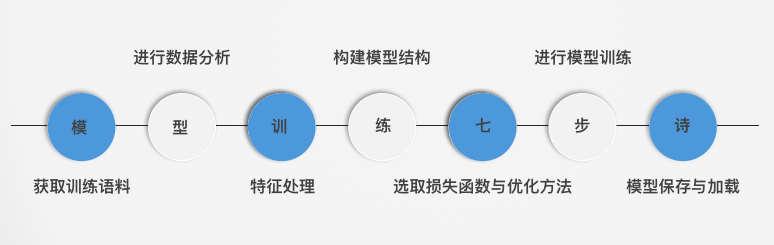
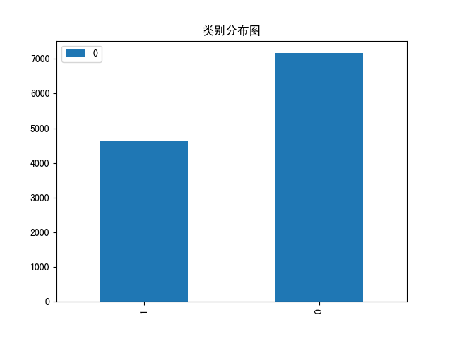
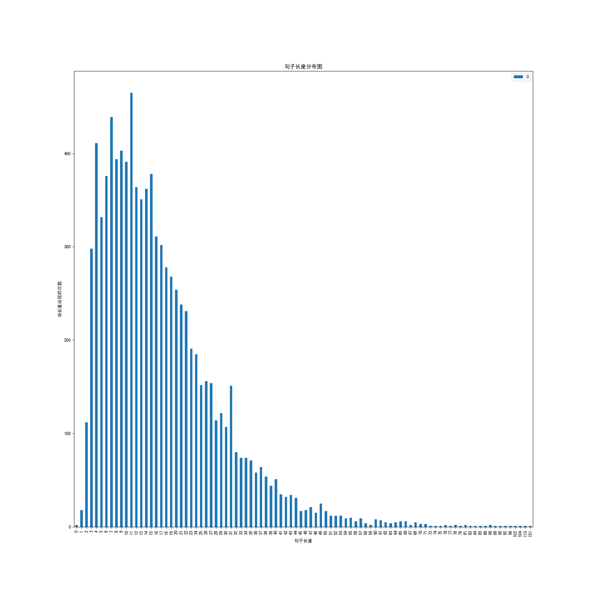
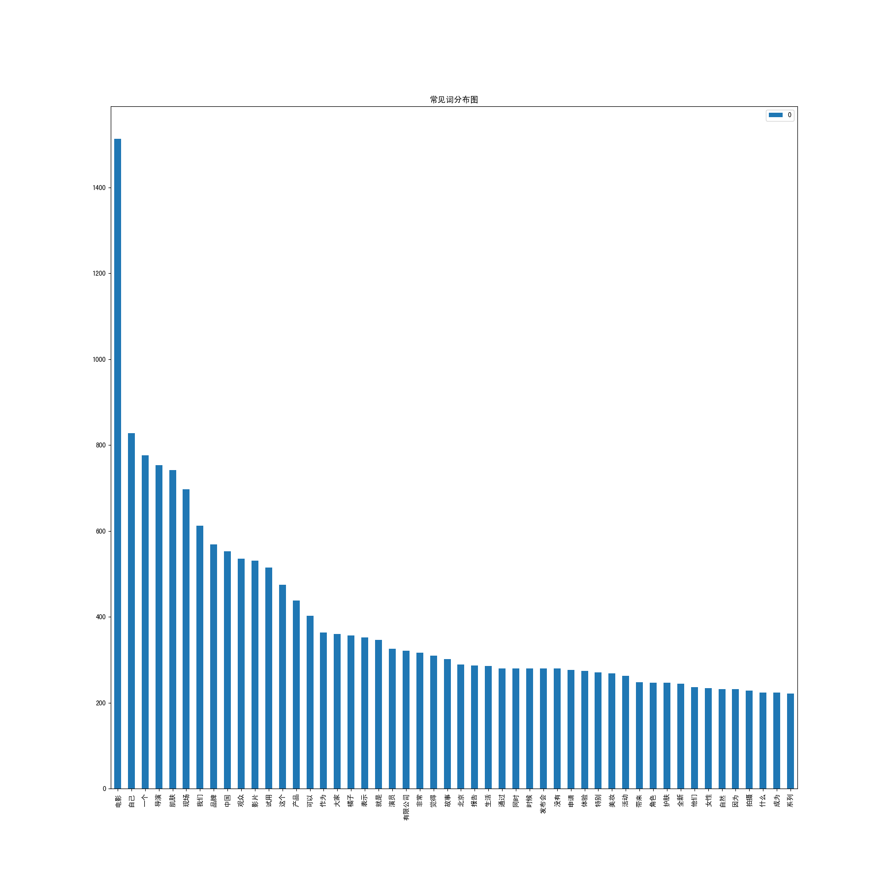
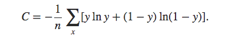
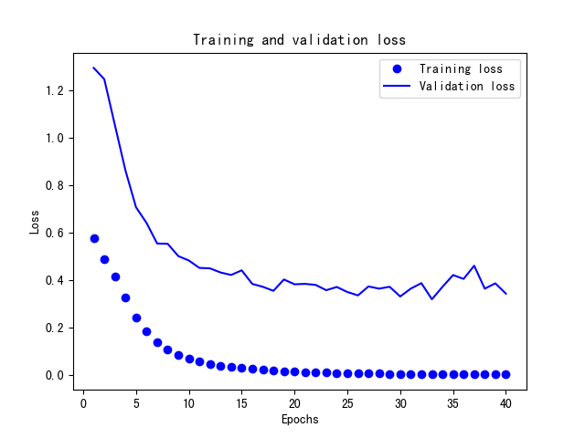
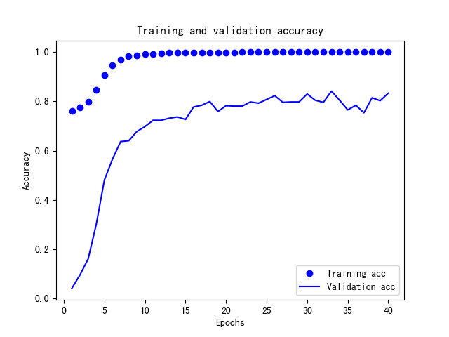

# 第三章:特征工程与fasttext模型训练

## 本章导学

- 学习目标:
  - 掌握如何进行fasttext模型的特征工程以及训练过程, 并实现它们.

------

- 引导分析:
  - 进行几乎是标准化模型训练流程.
  - fasttext模型，站在多模型训练与预测的效率角度上，使结构设计非常简单，以至于可能无法有效捕捉上下文的语义关系，因此加入n-gram特征进行了补充.

------

- 进行fasttext模型的特征工程以及训练过程的七步诗:



------

- 本章小节:
  - 3.1 获取训练语料
    - 学习如何从原始语料生成训练语料.
  - 3.2 进行数据分析
    - 学习使用训练语料进行一些统计分析工作.
  - 3.3 特征处理
    - 学习将n-gram作为特征加入到初始特征中.
  - 3.4 构建模型结构
    - 学习fasttext的模型的组成及其各个层的作用.
  - 3.5 选取损失函数和优化方法
    - 学习模型选择的损失函数和优化方法的数学原理和优缺点.
  - 3.6 进行模型训练
    - 学习模型在训练语料上的训练过程.
  - 3.7 模型的保存与加载
    - 学习训练之后的模型如何进行保存与加载.

------

------

------

## 3.1 获取训练语料

- 学习目标:
  - 掌握实现获取训练语料过程的三步曲.

------

- 获取训练语料过程的三步曲:
  - 第一步： 明确原始数据来源.
  - 第二步： 定义正负样本.
  - 第三步： 提取正负样本语料.

------

- 明确原始数据来源:
  - 公司内容生产小组提供的各种类型的文章.

------

- 定义正负样本:
  - 将文章中的每一条句子作为该类别的正样本； 将其他类别文章中的每一条句子作为负样本.

------

- 提取正负样本:
  - 先提取正样本语料，再在正样本基础上，提取正负样本语料.

------

- 提取正负样本过程的代码分析:


```
import os

# 限制句子的最小字符数和句子的最大字符数
MIN_LENGTH = 5
MAX_LENGTH = 500

def get_p_text_list(single_article_path):
    """获取单篇文章的文本列表"""
    with open(single_article_path, "r") as f:
        text = f.read()
        # 去掉换行符, 并以句号划分
        cl = text.replace("\n", ".").split("。")
        # 过滤掉长度范围之外的句子
        cl = list(filter(lambda x: MIN_LENGTH<len(x)<MAX_LENGTH, cl))
    return cl


def get_p_sample(a_path, p_path):
    """该函数用于获得正样本的csv, 以文章路径和正样本csv写入路径为参数"""
    if not os.path.exists(a_path): return
    if not os.path.exists(p_path): os.mkdir(p_path)
    # 以追加的方式打开预写入正样本的csv
    fp = open(os.path.join(p_path, "p_sample.csv"), "a")
    # 遍历文章目录下的每一篇文章
    for u in os.listdir(a_path):
        cl = get_p_text_list(os.path.join(a_path, u))
        for clc in cl:
            fp.write("1" + "\t" + clc + "\n")
    fp.close()


def get_sample(p_path, n_path_csv_list: list):
    """该函数用于获取样本集包括正负样本, 以正样本csv文件路径和负样本csv文件路径列表为参数"""
    fp = open(os.path.join(p_path, "sample.csv"), "w")
    with open(os.path.join(p_path, "p_sample.csv"), "r") as f:
        text = f.read()
    # 先将正样本写入样本csv之中
    fp.write(text)
    # 遍历负样本的csv列表
    for n_p_c in n_path_csv_list:
        with open(n_p_c, "r") as f:
            # 将其中的标签1改写为0
            text = f.read().replace("1", "0")
        # 然后写入样本的csv之中
        fp.write(text)
    fp.close()
```

------

- 代码位置: 代码将写在/data/django-uwsgi/text_labeled/model_train/get_sample.py中。

------

- 函数: get_p_text_list(single_article_path)

------

- 输入实例:


```
# 原始语料在上一个目录的create_graph目录下
single_article_path = "../create_graph/beauty/article-191721"
```

------

- 输出效果:


```
['卡姿兰携手全新品牌代言人威神V三子黄旭熙、钱锟、刘扬扬，引爆丝绒红唇诱惑魅力2019年7月23日，时尚彩妆领导品牌卡姿兰（Carslan）正式官宣，来自新晋人气男团威神V（WayV）的三位成员黄旭熙LUCAS、钱锟KUN、刘扬扬YANGYANG成为全新品牌代言人', 
'三位兼具帅气外表的实力派偶像自出道以来，便以各自独特的音乐个性和气质魅力征服了一众粉丝', 
'同为年轻实力派，此次卡姿兰携手三人，以丝绒唇膏的极致魅力引爆时尚热点', 
'卡姿兰正式官宣全新品牌代言人钱锟KUN、黄旭熙LUCAS、刘扬扬YANGYANG 无畏年轻实力派，极致演绎丝绒魅力出道不满一年却备受关注的中国男团威神V，以独特的音乐才能和超强的艺能感为中国乐坛注入了新鲜血液', 
'成员黄旭熙LUCAS、钱锟KUN、刘扬扬YANGYANG更以不俗的舞蹈实力与极具特色的音乐演绎技巧，在舞台上彰显出极强的个人气场', 
'气质美少年黄旭熙LUCAS凭借着精致五官和完美身材，成为备受粉丝追捧的“撕漫男”；威神V队长钱锟KUN有着温柔声线，尽显阳光暖男的成熟气质；年纪最小的刘扬扬YANGYANG可谓组合当中的鬼马精灵，身为德国华裔的他极富语言天赋', ' 在全新广告片中，三位男神牵手卡姿兰气场全开，演绎出高级丝绒时代的诱惑魅力', 
'在此系列中，黄旭熙LUCAS代言的卡姿兰丝绒10号色斗士唇膏，以复古深红显色而不挑肤的百搭特点，轻松驾驭各大场面，为新时代女性气场霸气加持']
```

------

- 函数: get_p_sample(a_path, p_path)

------

- 输入实例:


```
# 原始语料在上一个目录的create_graph目录下
a_path = "../create_graph/beauty/"
p_path = "./beauty"
```

------

- 输出效果:


```
# 获得一个p_sample.csv文件, 里面的内容形如:
1   这一次的《流星花园》主题体验馆如梦如幻，激荡起无数少女心，那么植物医生下一次制造的惊喜我们翘首以盼
1   美妆福利时间又到啦！本期免费试用产品：菲洛嘉新肌赋活乳霜价格/规格：739RMB/50ml试用总量：10份截至申请日期：2018年12月4日试用报告截至日期：2018年1月4日菲洛嘉新肌赋活乳霜，即新肌赋活面霜哑光型，更适合中性及混合肤质
1   高含量*NCTF是抵御肌肤老化、多重赋活美肌的理想解决方案
1   -盈润抚纹：透明质酸结合多肽，促进透明质酸生成，平滑纹路，密集丰盈肌肤；-紧致饱满：胶原蛋白促进因子**加强肌肤纤维支撑，结合透明质酸紧实弹韧肌肤；-焕亮气色：维他命C舒缓肌肤均匀肤色；维他命复合物A+H+E结合多酚植物精华，平滑肌理，焕发光泽，强化肌肤屏障，提升抵御力；-抑制油光：橄榄果酸+植物精华减少油脂分泌、收缩毛孔，持久营造哑光无油肤质
```

------

- 练一练:
  - 请同学们按照此方法, 将我们在目录/data/django-uwsgi/text_labeled/create_graph下, 给出的fashion, movie, star三个原始语料文件, 提取出它们正样本. 最终在对应的目录下生成p_sample.csv文件.

------

- 函数: get_sample(p_path, n_path_csv_list)

------

- 输入实例:


```
p_path = "./beauty"
n_path_csv_list = ["./movie/p_sample.csv", "./star/p_sample.csv", "./fashion/p_sample.csv"]
```

------

- 输出效果:


```
# 查看前5条的正样本:
1   #PINKGANG#：不粉所有人纪梵希2018全新禁忌之吻漆光唇蜜发布会暨派对 2018年8月19日，法国品牌纪梵希特别打造了一场精致酷炫的#PINKGANG#时尚派对，为庆祝纪梵希全新禁忌之吻漆光唇蜜（Gloss Interdit Vinyl）的闪耀上市
1   上海黄浦江畔的德必外滩8号，在历史悠久的法式古典建筑中，纪梵希与国内各大时尚媒体、时尚美妆领域的达人以及时髦人士一起分享并体验品牌的全新产品，感受品牌时尚叛逆的奢华魅力
1   超人气青春偶像陈立农作为品牌挚友出席活动，演员胡冰卿、陈瑶、李兰迪代表新时代潮流标杆受邀一同亮相派对，共同分享纪梵希全新唇蜜的炫目发布
1   值此之际，围绕着“#PINKGANG#不粉所有人”的主题，纪梵希为来宾营造出叛逆时髦、不受约束的派对氛围，充分展示了品牌一贯以来突破经典、个性前卫的态度
1   现场的布置以禁忌之吻漆光唇蜜的色彩为灵感，将霓虹粉色作为场馆的主色调，突显纪梵希全新产品神秘、禁忌、时尚的风格


# 查看后5条的负样本：
0   它采用皮革饰边塑造柔软休闲款式的轮廓，激光切割顶部
0   绉胶鞋底非常耐穿
0   系带的款式也很时髦哦~皮毛是天然连毛小绵羊皮，来自瑞士
0   皮革采用小绵羊皮，材质非常好，所以特别保暖，价格自然也会贵一些
0   大家可去Shopbop上购买，价格比UGG贵很多，但是质量也好~品牌：INUIKI 官网链接戳这←单品购买链接戳这←最后一句哎哟喂，这双00刚结束，又要开始剁手买雪地靴了！
```

------

- 练一练:
  - 请同学们按照此方法, 将我们在目录/data/django-uwsgi/text_labeled/create_graph下, 给出的fashion, movie, star三个原始语料文件, 提取出它们正负样本, 最终在对应的目录下生成sample.csv文件.

------

- 主要注释:


```
# 限制句子的最小字符数和句子的最大字符数

    """获取单篇文章的文本列表"""

        # 去掉换行符, 并以句号划分

        # 过滤掉长度范围之外的句子

    """该函数用于获得正样本的csv, 以文章路径和正样本csv写入路径为参数"""

    # 以追加的方式打开预写入正样本的csv

    # 遍历文章目录下的每一篇文章

    """该函数用于获取样本集包括正负样本, 以正样本csv文件路径和负样本csv文件路径列表为参数"""

    # 先将正样本写入样本csv之中

    # 遍历负样本的csv列表

            # 将其中的标签1改写为0

        # 然后写入样本的csv之中
```

------

- 小节总结:

  - 学习了获取训练语料过程的三步曲:
    - 第一步： 明确原始数据来源.
    - 第二步： 定义正负样本.
    - 第三步： 提取正负样本语料.

  ------

  - 学习了明确原始数据来源:
    - 公司内容生产小组提供的各种类型的文章.

  ------

  - 学习了定义正负样本:
    - 将文章中的每一条句子作为该类别的正样本； 将其他类别文章中的每一条句子作为负样本.

  ------

  - 学习并实现了提取正负样本:
    - 先提取正样本语料，再在正样本基础上，提取正负样本语料.

------

------

------

## 3.2 进行数据分析

- 学习目标:
  - 掌握文本数据必要的分析过程并理解它们的作用.

------

- 文本数据必要的分析过程:
  - 获取正负样本的分词列表和对应的标签.
  - 获取正负标签数量分布.
  - 获取句子长度分布.
  - 获取常见词频分布.

------

- 获取正负样本的分词列表和对应的标签
  - 作用: 为进行可视化数据分析, 如获取正负标签数量分布, 获取句子长度分布, 获取常见词频分布等作数据准备.

------

- 获取正负标签数量分布
  - 作用: 用于帮助调整正负样本比例, 而调整正负样本比例, 对我们进行接下来的数据分析和判断模型准确率基线起到关键作用.

------

- 举个栗子:


```
假如正样本数量为8万条, 负样本数量为2万条,
如果我们不做任何样本调整工作, 就将其输送给模型训练,
那么模型很快就能找到一个规律, 就是不分青红皂白的都把结果预测为正样本,
也可以得到差不多80%的准确率.
这就说明我们此时模型的准确率基线就是80%, 因此这是不合理的, 
所以我们必须均衡正负样本, 保证模型基线在50%左右, 这样得到准确率80%的模型才算得上有意义.
```

------

- 获取句子长度分布
  - 作用: 用于帮助判断句子合理的截断对齐长度, 而合理的截断长度将有效的避免稀疏特征或冗余特征的产生, 提升训练效率.

------

- 举个栗子:


```
假如我们有10万条数据, 其中9.9万条的句子长度都在100个字符内,
只有剩下的一小部分句子长度非常长,
因为模型的输入需要是矩阵, 也就是等长向量, 因此文本需要进行截断对齐, 
而分析在什么长度进行截断对齐十分重要,
如果我们以最长长度对齐的话, 将有9.9万条数据扩充没有必要的特征长度,
不仅占用更多的内存, 并且导致模型参数激增, 模型训练效率下降.
```

------

- 获取常见词频分布
  - 作用: 指导之后模型超参数max_feature(最大的特征总数)的选择和初步评估数据质量.

------

- 解释:


```
模型超参数max_feature的选定在NLP领域一般是大于所有语料涉及的词汇总数的, 
但是又不能选择过于大, 否则会导致网络参数激增, 模型过于复杂，容易过拟合.
因此需要参考词汇总数.

同时, 词频分布可以看出高频词汇与类别的相关性, 判断正负样本的是否对分类产生效果.
```

------

- 获取正负样本分词列表和对应的标签过程的代码分析:


```
import pandas as pd
import jieba

def get_data_labels(csv_path): 
    """获得训练数据和对应的标签, 以正负样本的csv文件路径为参数"""
    # 使用pandas读取csv文件至内存
    df = pd.read_csv(csv_path, header=None, sep="\t")

    # 对句子进行分词处理并过滤掉长度为1的词
    train_data = list(map(lambda x: list(filter(lambda x: len(x)>1, 
                                    jieba.lcut(x))), df[1].values)) 

    # 取第0列的值作为训练标签
    train_labels = df[0].values 
    return train_data, train_labels
```

------

- 代码位置: 代码将写在/data/django-uwsgi/text_labeled/model_train/data_analysis.py中.

------

- 输入实例:


```
# 样本csv文件路径
csv_path = "./movie/sample.csv"
```

------

- 输出效果:


```
# train_data
[['今日', '捉妖', '北京', '举办', '全球', '首映礼', '发布会', '导演'], 
 ['许诚毅', '各位', '主演', '亮相', '现场', '各位', '演员'], 
 [ '大家', '讲述', '自己', '拍摄', '过程', '发生', '趣事', '大家', '分享'], 
 [ '自己', '过年', '计划', '现场', '布置', '十分', '喜庆', '放眼望去', '一片', '红彤彤', '颜色', '感受', '浓浓的', '年味'],
 ['胡巴', '遭遇', '危险', '全民', '追击', '发布', '预告片', '当中', '胡巴'], 
 ['遭到', '追杀', '流落', '人间', '梁朝伟', '收留', '与此同时'], ...]


# train_labels
[1 1 1 ... 0 0 0]
```

------

- 获取标签类别数量分布过程的代码分析:


```
import os
from collections import Counter

def pic_show(pic, pic_path, pic_name):
    """用于图片显示，以图片对象和预保存的路径为参数"""
    if not os.path.exists(pic_path): os.mkdir(pic_path)
    pic.savefig(os.path.join(pic_path, pic_name)
    print("请通过地址http://47.92.175.143:8087/text_labeled/model_train" + pic_path[1:] + pic_name + "查看.")


def get_labels_distribution(train_labels, pic_path, pic_name="ld.png"):
    """获取正负样本数量的基本分布情况"""
    # class_dict >>> {1: 3995, 0: 4418}
    class_dict = dict(Counter(train_labels))
    print(class_dict)
    df = pd.DataFrame(list(class_dict.values()), list(class_dict.keys()))
    pic = df.plot(kind='bar', title="类别分布图").get_figure()
    pic_show(pic, pic_path, pic_name)
```

------

- 代码位置: 代码将写在/data/django-uwsgi/text_labeled/model_train/data_analysis.py中.

------

- 输入实例:


```
# get_data_labels函数得到的train_labels

# 图片的存储路径 
pic_path = "./movie/"

# 图片的名字, 默认是ld.png
pic_name = "ld.png"
```

------

- 输出效果:


```
{1: 4640, 0: 7165}

标签类别数量分布图, 位于./movie/ld.png
```



- 结果分析:
  - 当前的正负样本数量是分别是: 4640和7165,相差2525条数据.
  - 为了使正负样本均衡, 让它们的比例为1:1, 我们将在之后进行的该类别的数据分析和模型训练中, 去掉2525条负样本的数量.

------

- 获取句子长度分布过程的代码分析:


```
def get_sentence_length_distribution(train_data, pic_path, pic_name="sld.png"):
    """该函数用于获得句子长度分布情况"""
    sentence_len_list = list(map(len, train_data))
    # len_dict >>> {38: 62, 58: 18, 40: 64, 35: 83,....}  
    len_dict = dict(Counter(sentence_len_list))
    len_list = list(zip(len_dict.keys(), len_dict.values()))
    # len_list >>> [(1, 3), (2, 20), (3, 51), (4, 96), (5, 121), (6, 173), ...]
    len_list.sort(key=(lambda x: x[0]))
    df = pd.DataFrame(list(map(lambda x: x[1], len_list)), list(
        map(lambda x: x[0], len_list)))
    ax = df.plot(kind='bar', figsize=(18, 18), title="句子长度分布图")
    ax.set_xlabel("句子长度")
    ax.set_ylabel("该长度出现的次数")
    pic = ax.get_figure()
    pic_show(pic, pic_path, pic_name)
```

------

- 代码位置: 代码将写在/data/django-uwsgi/text_labeled/model_train/data_analysis.py中.

------

- 输入实例:


```
# 通过get_data_labels得到的train_data(需要进行均衡切片)

# 图片的存储路径
pic_path = "./movie/"

# 图片的名字, 默认是sld.png
pic_name = "sld.png"
```

------

- 输出效果:


```
句子长度分布图, 位于./movie/sld.png
```



- 结果分析:
  - 通过句子长度分布图, 我们知道了句子的长度范围在0-151之间.
  - 但在0-60的长度之间, 已经包含了超过90%的句子, 因此这里可以认为60的长度是一个合理的截断对齐长度, 即不会使大量句子被截断而失去主要信息, 又能够有效避免补齐的特征数量太多, 导致模型参数过大.

------

- 获取常见词频分布的代码分析过程:


```
from itertools import chain

def get_word_frequency_distribution(train_data, pic_path, pic_name="wfd.png"):
    """该函数用于获得词频分布"""
    vocab_size = len(set(chain(*train_data)))
    print("所有样本共包含不同词汇数量为：", vocab_size)
    # 获取常见词分布字典，以便进行绘图
    # common_word_dict >>> {'电影': 1548, '自己': 968, '一个': 850, '导演': 757, '现场': 744, ...}
    common_word_dict = dict(Counter(chain(*train_data)).most_common(50))
    df = pd.DataFrame(list(common_word_dict.values()),
                       list(common_word_dict.keys()))
    pic = df.plot(kind='bar', figsize=(18, 18), title="常见词分布图").get_figure()
    pic_show(pic, pic_path, pic_name)
```

------

- 代码位置: 代码将写在/data/django-uwsgi/text_labeled/model_train/data_analysis.py中.

------

- 输入实例:


```
# 通过get_data_labels得到的train_data(需要进行均衡切片)

# 图片的存储路径
pic_path = "./movie/"

# 图片的名字, 默认是wfd.png
pic_name = "wfd.png"
```

------

- 输出效果:


```
所有样本共包含不同词汇数量为：24020

电影训练集常见词分布图, 位于./movie/wfd.png
```



- 结果分析:
  - 通过常见词频分析, 全文词汇总数为24020, 在模型训练时定义的max_features应大于该数值.
  - 同时对比高频词汇中出现的与影视相关的词汇占比大概在50%左右, 符合正负样本的分布比例, 因此语料质量尚可.

------

- 主要注释:


```
    """获得训练数据和对应的标签, 以正负样本的csv文件路径为参数"""

    # 使用pandas读取csv文件至内存

    # 对句子进行分词处理并过滤掉长度为1的词

    # 取第0列的值作为训练标签


    """用于图片显示，以图片对象和预保存的路径为参数"""

    """获取正负样本数量的基本分布情况"""

    # class_dict >>> {1: 3995, 0: 4418}

    """该函数用于获得句子长度分布情况"""

    # len_dict >>> {38: 62, 58: 18, 40: 64, 35: 83,....}  

    # len_list >>> [(1, 3), (2, 20), (3, 51), (4, 96), (5, 121), (6, 173), ...]


    """该函数用于获得词频分布"""

    # 获取常见词分布字典，以便进行绘图

    # common_word_dict >>> {'电影': 1548, '自己': 968, '一个': 850, '导演': 757, '现场': 744, ...}
```

------

- 练一练:
  - 请同学们按照上面学习的数据分析方法, 对其他给出的训练数据(fashion, beauty, star), 进行类似的数据分析, 并在对应的文件中生成三张分布图.

------

------

- 小节总结:

  - 学习了文本数据分析的过程:
    - 获取正负样本的分词列表和对应的标签.
    - 获取正负标签数量分布.
    - 获取句子长度分布.
    - 获取常见词频分布.

  ------

  - 学习并实现了获取正负样本的分词列表和对应的标签.
    - 作用: 为进行可视化数据分析作数据准备.
    - 实现函数: get_data_labels

  ------

  - 学习并实现了获取正负标签数量分布.
    - 作用: 用于帮助调整正负样本比例, 而调整正负样本比例, 对我们进行接下来的数据分析和判断模型准确率基线起到关键作用.
    - 实现函数: get_labels_distribution

  ------

  - 学习并实现了获取句子长度分布.
    - 作用: 用于帮助判断句子合理的截断长度.
    - 实现函数: get_sentence_length_distribution

  ------

  - 学习并实现了获取常见词频分布.
    - 作用: 指导之后模型超参数max_features的选择和初步评估数据质量.
    - 实现函数: get_word_frequency_distribution

------

------

------

## 3.3 特征处理

- 学习目标:
  - 掌握实现特征处理过程的四步曲及其作用.

------

- 特征处理过程的四步曲:
  - 第一步: 进行词汇映射
  - 第二步: 将向量进行合适截断
  - 第三步: 加入n-gram特征
  - 第四步: 将向量进行最长补齐

------

- 进行词汇映射:
  - 作用: 将分词列表中的每个词映射成数字.

------

- 举个栗子


```
分词(词汇)列表: ["有时", "我想", "放弃", "挣扎", "也放下", "我", "写字的手"]

把每个词映射成数字, 得到序列列表: [1, 2, 3, 4, 5, 6, 7]


分词列表: ["可是", "我已经", "放弃", "太多", "还坚持", "着说", "还坚持", "着走"]

得到序列列表: [8, 9, 3, 10, 11, 12, 11, 13]
```

------

- 将向量进行合适截断对齐:
  - 作用: 将映射后的句子向量进行截断，以降低模型输入的特征维度，来防止过拟合.

------

- 举个栗子:


```
序列列表: [[1, 2, 3, 4, 5, 6], [1, 3, 9], [2, 4, 6], [2, 3]]

以长度3进行截断对齐后得到

新的序列列表: [[1, 2, 3], [1, 3, 9], [2, 4, 6], [2, 3, 0]]
```

------

- 加入n-gram特征:
  - 作用: 将n-gram表示作为特征，能够补充特征中没有上下文关联的缺点，将有效帮助模型捕捉上下文的语义关联.

------

- 举个栗子:


```
在这里, 可以将n-gram特征可以理解为相邻词汇的共现特征, 当n为2时, 就是连续两个词的共现.

我们这里将使用2-gram, 因此以2-gram为例进行解释:

分词列表: ["是谁", "敲动", "我心"]

对应的序列列表: [1, 34, 21]

我们可以认为序列列表中的每个数字就是原始句子的特征, 即词汇是原始句子的特征.

除此之外, 我们还可以把"是谁"和"敲动"两个词共同出现且相邻也作为一种特征加入到序列列表中,

此时序列列表就变成了包含2-gram特征的特征列表: [1, 34, 21, 1000]

这里的1000就代表"是谁"和"敲动"共同出现且相邻, 这种特征也就是n-gram特征.其中n为2.
```

------

- 将向量进行最长补齐:
  - 作用: 为了不损失n-gram特征，使向量能够以矩阵形式作为模型输入.

------

- 举个栗子:


```
和第二步截断补齐类似:

序列列表: [[1, 2, 3, 4, 5, 6], [1, 3, 9], [2, 4, 6], [2, 3]]

以最长长度进行对齐后得到

新的序列列表: [[1, 2, 3, 4, 5, 6], [1, 3, 9, 0, 0, 0], [2, 4, 6, 0, 0, 0], [2, 3, 0, 0, 0, 0]]
```

------

- 进行词汇映射的代码分析过程:


```
# 导入用于对象保存与加载的joblib
from sklearn.externals import joblib
# 导入keras中的词汇映射器Tokenizer
from keras.preprocessing.text import Tokenizer
# 导入从样本csv到内存的get_data_labels函数
from data_analysis import get_data_labels


def word_map(csv_path, tokenizer_path, cut_num):
    """进行词汇映射，以训练数据的csv路径和映射器存储路径以及截断数为参数"""
    # 使用get_data_labels函数获取简单处理后的训练数据和标签
    train_data, train_labels = get_data_labels(csv_path)
    # 进行正负样本均衡切割, 使其数量比例为1:1
    train_data = train_data[:-cut_num]
    train_labels = train_labels[:-cut_num]
    # 实例化一个词汇映射器对象
    t = Tokenizer(num_words=None, char_level=False)
    # 使用映射器拟合现有文本数据
    t.fit_on_texts(train_data)
    # 使用joblib工具保存映射器
    joblib.dump(t, tokenizer_path)
    # 使用映射器转化现有文本数据
    x_train = t.texts_to_sequences(train_data)
    # 获得标签数据
    y_train = train_labels
    return x_train, y_train
```

------

- 代码位置: 代码将写在/data/django-uwsgi/text_labeled/model_train/movie_model_train.py中.

------

- 输入实例:


```
# 对应的样本csv路径
csv_path = "./movie/sample.csv"

# 词汇映射器保存的路径
tokenizer_path = "./movie/Tokenizer"

# 截断数
cut_num = 2525
```

- 输出效果:


```
# x_train
[[3480, 485, 9674, 979, 23, 67, 39, 1097, 432, 49, 27584, 205], 
 [17, 27585, 27586, 1355, 27587, 14019, 65, 100],
 [2282, 2609, 7, 7616, 1897, 2302, 274, 1355, 2302, 20],
 [57, 27588, 13601, 135, 586, 134, 4138], ...]

# y_train
[1 1 1 ... 0 0 0]
```

------

- 主要注释:


```
# 导入用于对象保存与加载的joblib
# 导入keras中的词汇映射器Tokenizer
# 导入从样本csv到内存的get_data_labels函数

    """进行词汇映射，以训练数据的csv路径和映射器存储路径以及截断数为参数"""

    # 使用get_data_labels函数获取简单处理后的训练数据和标签

    # 进行正负样本均衡切割, 使其数量比例为1:1

    # 实例化一个词汇映射器对象

    # 使用映射器拟合现有文本数据

    # 使用joblib工具保存映射器

    # 使用映射器转化现有文本数据

    # 获得标签数据
```

------

- 向量截断对齐的代码分析过程:


```
from keras.preprocessing import sequence

# cutlen根据数据分析中句子长度分布，覆盖90%语料的最短长度.
cutlen = 60
def padding(x_train, cutlen):
    return sequence.pad_sequences(x_train, cutlen)
```

------

- 代码位置: 代码将写在/data/django-uwsgi/text_labeled/model_train/movie_model_train.py中.

------

- 输入实例:


```
# 通过word_map函数获得的x_train

# 通过数据分析获得的截断长度
cutlen = 60
```

------

- 输出效果:


```
# 进行截断补齐后的矩阵x_train
[[    0     0     0 ...    49  5576  5577]
 [    0     0  1682 ...     1  1682  7179]
 [    0     0     0 ...   148 10517  7183]
 ...
 [    0     0     0 ...  7245  1567  1731]
 [    0     0     0 ...  1872   364 20985]
 [    0     0     0 ... 10353  1207 20989]]
```

------

- 主要注释


```
# cutlen根据数据分析中句子长度分布，覆盖90%语料的最短长度.
```

------

- 加入n-gram特征过程的代码分析:


```
import numpy as np

# 根据样本集最大词汇数选择最大特征数，应大于样本集最大词汇数
max_features = 25000

# n-gram特征的范围，一般选择为2
ngram_range = 2

def create_ngram_set(input_list, ngram_value=2):
    """
    从列表中提取n-gram特征
    >>> create_ngram_set([1, 4, 9, 4, 1, 4], ngram_value=2)
    {(4, 9), (4, 1), (1, 4), (9, 4)}
    """
    return set(zip(*[input_list[i:] for i in range(ngram_value)]))


def get_ti_and_nmf(x_train, ti_path, ngram_range):
    """从训练数据中获得token_indice和新的max_features"""
    # >>> token_indice = {(1, 3): 1337, (9, 2): 42, (4, 5): 2017}
    # 创建一个盛装n-gram特征的集合.
    ngram_set = set()
    # 遍历每一个数值映射后的列表
    for input_list in x_train:
        # 遍历可能存在2-gram, 3-gram等
        for i in range(2, ngram_range + 1):
            # 获得对应的n-gram表示 
            set_of_ngram = create_ngram_set(input_list, ngram_value=i)
            # 更新n-gram集合
            ngram_set.update(set_of_ngram)

    # 去除掉(0, 0)这个2-gram特征
    ngram_set.discard(tuple([0]*ngram_range))
    # 将n-gram特征映射成整数.
    # 为了避免和之前的词汇特征冲突，n-gram产生的特征将从max_features+1开始
    start_index = max_features + 1
    # 得到对n-gram表示与对应特征值的字典
    token_indice = {v: k + start_index for k, v in enumerate(ngram_set)}
    # 将token_indice写入文件以便预测时使用
    with open(ti_path, "w") as f:
        f.write(str(token_indice))
    # token_indice的反转字典，为了求解新的最大特征数
    indice_token = {token_indice[k]: k for k in token_indice}
    # 获得加入n-gram之后的最大特征数
    new_max_features = np.max(list(indice_token.keys())) + 1
    return token_indice, new_max_features


def add_ngram(sequences, token_indice, ngram_range=2):
    """
    将n-gram特征加入到训练数据中
    如: adding bi-gram
    >>> sequences = [[1, 3, 4, 5], [1, 3, 7, 9, 2]]
    >>> token_indice = {(1, 3): 1337, (9, 2): 42, (4, 5): 2017}
    >>> add_ngram(sequences, token_indice, ngram_range=2)
    [[1, 3, 4, 5, 1337, 2017], [1, 3, 7, 9, 2, 1337, 42]]
    """
    new_sequences = []
    # 遍历序列列表中的每一个元素作为input_list, 即代表一个句子的列表
    for input_list in sequences:
        # copy一个new_list
        new_list = input_list[:].tolist()
        # 遍历n-gram的value，至少从2开始
        for ngram_value in range(2, ngram_range + 1):
            # 遍历各个可能的n-gram长度
            for i in range(len(new_list) - ngram_value + 1):
                # 获得input_list中的n-gram表示
                ngram = tuple(new_list[i:i + ngram_value])
                # 如果在token_indice中，则追加相应的数值特征
                if ngram in token_indice:
                    new_list.append(token_indice[ngram])
        new_sequences.append(new_list)
    return np.array(new_sequences)
```

- 代码位置: 代码将写在/data/django-uwsgi/text_labeled/model_train/movie_model_train.py中.

------

- 函数create_ngram_set(input_list, ngram_value=2):

------

- 输入实例:


```
input_list = [1, 4, 9, 4, 1, 4]
```

------

- 输出效果:


```
# 2-gram特征组成的集合
{(4, 1), (9, 4), (4, 9), (1, 4)}
```

------

- 函数get_ti_and_nmf(x_train, ti_path, ngram_range):

------

- 输入实例:


```
# 数据进行截断对齐后的矩阵x_train

# token_indice的保存路径
ti_path = "./movie/token_indice"
```

------

- 输出效果:


```
# token_indice 2-gram特征对应的数值

{(28, 1329): 143282, (413, 841): 143283, 
(8731, 6757): 143284, (4975, 68): 143285, 
(581, 9339): 143286, (744, 1819): 143287, 
(16, 1368): 143288, (17661, 4177): 143289,
 (20, 76): 143290, (495, 418): 143291, ...}

# new_max_features 新的最大特征数
143307
```

------

- 函数add_ngram(sequences, token_indice, ngram_range=2):

------

- 输入实例:


```
# 数据进行截断对齐后的矩阵x_train, 也就是输入sequences

# 由函数get_ti_and_nmf得到的token_indice
```

------

- 输出效果:


```
# 添加了n-gram特征的矩阵x_train
[list([0, 0, 0, 0, 0, 0, 0, 0, 0, 0, 0, 0, 0, 0, 1296, 1086, 9, 2510, 2325, 1004, 668, 2990, 669, 482, 669, 335, 126063, 46370, 36768, 93632, 116281, 46593, 136403, 29955, 34254, 127711, 47353, 132158])
 list([0, 0, 0, 0, 11, 4, 8280, 26, 2511, 2991, 528, 22, 411, 702, 11, 350, 8281, 604, 85, 1501, 468, 52, 11, 56, 3255, 104815, 38229, 35505, 67872, 28659, 50795, 140653, 113341, 65967, 78902, 57072, 108083, 29205, 115079, 61698, 48928, 42416, 46802, 110530, 99281, 40828])
...
]
```

- 主要注释:


```
# 根据样本集最大词汇数选择最大特征数，应大于样本集最大词汇数

# n-gram特征的范围，一般选择为2

    """
    从列表中提取n-gram特征
    >>> create_ngram_set([1, 4, 9, 4, 1, 4], ngram_value=2)
    {(4, 9), (4, 1), (1, 4), (9, 4)}
    """

    """从训练数据中获得token_indice和新的max_features"""
    # >>> token_indice = {(1, 3): 1337, (9, 2): 42, (4, 5): 2017}
    # 创建一个盛装n-gram特征的集合.
    # 遍历每一个数值映射后的列表
        # 遍历可能存在2-gram, 3-gram等
            # 获得对应的n-gram表示 
            # 更新n-gram集合
    # 去除掉(0, 0)这个2-gram特征
    # 将n-gram特征映射成整数.
    # 为了避免和之前的词汇特征冲突，n-gram产生的特征将从max_features+1开始
    # 得到对n-gram表示与对应特征值的字典
    # 将token_indice写入文件以便预测时使用
    # token_indice的反转字典，为了求解新的最大特征数
    # 获得加入n-gram之后的最大特征数


    """
    将n-gram特征加入到训练数据中
    如: adding bi-gram
    >>> sequences = [[1, 3, 4, 5], [1, 3, 7, 9, 2]]
    >>> token_indice = {(1, 3): 1337, (9, 2): 42, (4, 5): 2017}
    >>> add_ngram(sequences, token_indice, ngram_range=2)
    [[1, 3, 4, 5, 1337, 2017], [1, 3, 7, 9, 2, 1337, 42]]
    """
    # 遍历序列列表中的每一个元素作为input_list, 即代表一个句子的列表
        # copy一个new_list
        # 遍历n-gram的value，至少从2开始
            # 遍历各个可能的n-gram长度
                # 获得input_list中的n-gram表示
                # 如果在token_indice中，则追加相应的数值特征
```

------

- 将向量进行最长补齐过程的代码分析:


```
def align(x_train):
    """用于向量按照最长长度进行补齐"""
    # 获得所有句子长度的最大值
    maxlen = max(list(map(lambda x: len(x), x_train)))
    # 调用padding函数
    x_train = padding(x_train, maxlen)
    return x_train, maxlen
```

------

- 代码位置: 代码将写在/data/django-uwsgi/text_labeled/model_train/movie_model_train.py中.

------

- 输入实例:


```
# 由函数add_ngram输出的矩阵x_train
```

------

- 输出效果:


```
# 进行了最大长度补齐的矩阵x_train
[[     0      0      0 ... 113541  36959  22941]
 [     0      0   1682 ...  42518  59855  25524]
 [     0      0      0 ...  75385  50810  68725]
 ...
 [     0      0      0 ...  97401  34490  77114]
 [     0      0      0 ...  21440  85555  32122]
 [     0      0      0 ...  56394  95696  45331]]

# 补齐的最大长度
119
```

------

- 主要注释:


```
    """用于向量按照最长长度进行补齐"""
    # 获得所有句子长度的最大值
    # 调用padding函数
```

------

- 练一练:
  - 请同学们根据本小节学习的特征处理过程,在/data/django-uwsgi/text_labeled/model_train目录下, 创建star_model_train.py, beauty_model_train.py, fashion_model_train.py三个文件, 并根据数据分析的结果写出它们的特征处理流程.

------

------

- 小节总结:

  - 学习了特征处理过程的四步曲:
    - 第一步: 进行词汇映射
    - 第二步: 将向量进行合适截断
    - 第三步: 加入n-gram特征
    - 第四步: 将向量进行最长补齐

  ------

  - 学习并实现了进行词汇映射:
    - 作用: 将分词列表中的每个词映射成数字.
    - 函数: word_map

  ------

  - 学习并实现了将向量进行合适截断补齐:
    - 作用: 将映射后的句子向量进行截断补齐，以降低模型输入的特征维度，来防止过拟合.
    - 函数: padding

  ------

  - 学习并实现了加入n-gram特征:
    - 作用: 将n-gram表示作为特征，能够补充特征中没有上下文关联的缺点，将有效帮助模型捕捉上下文的语义关联.
    - 函数: create_ngram_set
    - 函数: get_ti_and_nmf
    - 函数: add_ngram

  ------

  - 学习并实现了将向量进行最长补齐:
    - 作用: 为了不损失n-gram特征，使向量能够以矩阵形式作为模型输入.
    - 函数: align

------

------

------

## 3.4 构建模型结构

- 学习目标:
  - 掌握fasttext模型结构中三个重要的层并使用它们构建模型.

------

- fasttext模型结构中三个重要的层:
  - Embedding层
  - GAP层(全局平均池化层)
  - Dense + sigmoid层

------

- Embedding层:
  - 层结构: 结构可以看作是一个矩阵，它的大小是语料的最大特征数(new_max_features)乘以我们预定义的embedding_dims，这个矩阵就相当于是由每一个特征拓展成embedding_dims后的表示.
  - 层参数: 矩阵中的每一个数，都是模型需要求解的参数，因此Embedding层的参数总量是new_max_features x embedding_dims.
  - 输入参数: new_max_features即最大特征数, embedding_dims即词嵌入维度, input_length即句子的最大长度.
  - 输入形状: [None, input_length]
  - 输出形状: [None, input_length, embedding_dims]
  - 作用: 用向量表示每一个特征，在更高维度的映射空间捕捉词与词之间的关系.

------

- GAP层:
  - 层结构: 本质上是对矩阵的一种计算方法，无结构.
  - 层参数: 无
  - 输入参数: 无
  - 输入形状: [None, input_length, embedding_dims]
  - 输出形状: [None, embedding_dims]
  - 作用: 消减模型参数总量，防止过拟合.

------

- Dense + sigmoid层:
  - 层结构: 具有个1个节点的一层全连接网络，最后的激活函数使用sigmoid.
  - 层参数: 该节点中的w向量共50维，加上一个偏置b，共51个参数.
  - 输入参数: 分别是该层的节点数以及使用的sigmoid函数.
  - 输入形状: [None, embedding_dims]
  - 输出形状: [None, 1]
  - 作用: 将抽象的特征表示归一到指定的类别上，能够输出我们想要的0或者1的结果.

------

- 使用上面三个层构建fasttext模型的代码分析:


```
# 首先导入keras构建模型的必备工具包
from keras.models import Sequential
from keras.layers import Dense
from keras.layers import Embedding
from keras.layers import GlobalAveragePooling1D

# 定义词嵌入维度为50
embedding_dims = 50


def model_build(maxlen, new_max_features):
    """该函数用于模型结构构建"""

    # 在函数中，首先初始化一个序列模型对象
    model = Sequential()

    # 然后首层使用Embedding层进行词向量映射
    model.add(Embedding(new_max_features,
                        embedding_dims,
                        input_length=maxlen))

    # 然后用构建全局平均池化层，减少模型参数，防止过拟合
    model.add(GlobalAveragePooling1D())

    # 最后构建全连接层 + sigmoid层来进行分类.
    model.add(Dense(1, activation='sigmoid'))
    return model
```

- 代码位置: 代码将写在/data/django-uwsgi/text_labeled/model_train/movie_model_train.py中.

------

- 输入实例:


```
# 最大对齐长度, 即输入矩阵中每条向量的长度
maxlen = 119

# 最大特征数, 即输入矩阵中元素的最大值
new_max_features = 143307

# 词嵌入的数量, 使用50维
embedding_dims = 50
```

------

- 输出效果:


```
# keras sequential的model对象:
<keras.engine.sequential.Sequential object at 0x7f67cc2bf208>
```

- 主要注释:


```
# 首先导入keras构建模型的必备工具包

# 定义词嵌入维度为50
    """该函数用于模型结构构建"""

    # 在函数中，首先初始化一个序列模型对象

    # 然后首层使用Embedding层进行词向量映射

    # 然后用构建全局平均池化层，减少模型参数，防止过拟合

    # 最后构建全连接层 + sigmoid层来进行分类.
```

------

- 练一练:
  - 请同学们根据本小节学习的模型构建过程,在/data/django-uwsgi/text_labeled/model_train目录下的star_model_train.py, beauty_model_train.py, fashion_model_train.py三个文件中, 写出它们的模型结构构建函数.

------

- 小节总结:

  - 学习了fasttext模型结构中三个重要的层:
    - Embedding层
    - GAP层(全局平均池化层)
    - Dense + sigmoid层

  ------

  - 学习了Embedding层:
    - 层结构: 结构可以看作是一个矩阵，它的大小是语料的最大特征数(new_max_features)乘以我们预定义的embedding_dims，这个矩阵就相当于是由每一个特征拓展成embedding_dims后的表示.
    - 层参数: 矩阵中的每一个数，都是模型需要求解的参数，因此Embedding层的参数总量是new_max_features x embedding_dims.
    - 输入参数: new_max_features即最大特征数, embedding_dims即词嵌入维度, input_length即句子的最大长度.
    - 输入形状: [None, input_length]
    - 输出形状: [None, input_length, embedding_dims]
    - 作用: 用向量表示每一个特征，在更高维度的映射空间捕捉词与词之间的关系.

  ------

  - 学习了GAP层:

    - 层结构: 本质上是对矩阵的一种计算方法，无结构.
    - 层参数: 无
    - 输入参数: 无
    - 输入形状: [None, input_length, embedding_dims]
    - 输出形状: [None, embedding_dims]
    - 作用: 消减模型参数总量，防止过拟合.

    ------

  - 学习了Dense + sigmoid层:

    - 层结构: 具有个1个节点的一层全连接网络，最后的激活函数使用sigmoid.
    - 层参数: 该节点中的w向量共50维，加上一个偏置b，共51个参数.
    - 输入参数: 分别是该层的节点数以及使用的sigmoid函数.
    - 输入形状: [None, embedding_dims]
    - 输出形状: [None, 1]
    - 作用: 将抽象的特征表示归一到指定的类别上，能够输出我们想要的0或者1的结果.

  ------

  - 学习并实现了使用上面三个层构建fasttext模型.
    - 函数: model_build

------

------

------

## 3.5 选取损失函数和优化方法

- 学习目标:
  - 掌握fasttext模型选取的损失函数与优化方法及其实现.

------

- fasttext模型选取的损失函数:
  - 二分类交叉熵损失函数

------

- fasttext模型选取的优化方法:
  - Adam

------

- 二分类交叉熵损失:
  - 作用: 用于描述模型预测值与真实值的差距大小.
  - 形式： 
  - 优势: 作为一种优化后的损失函数，能够避免均方误差损失的在处理sigmoid函数时收敛到趋于1时，梯度非常平缓，又因为使用的优化方法往往基于梯度下降，所以出现”学习迟缓”的现象.为了避免该现象，交叉熵的形式应运而生。

------

- Adam优化方法:
  - 作用: 求损失函数最优解的方法.
  - 优势: 结合Adagrad与RSMProp的算法特点， 对梯度的一阶矩估计（即梯度的均值）和二阶矩估计（即梯度的未中心化的方差）进行综合考虑，计算出更新步长. 学习率可自由调节.

------

- 实现在选取损失函数与优化方法的代码分析过程:


```
def model_compile(model):
    """用于选取模型的损失函数和优化方法"""
    # 使用model自带的compile方法，选择预定义好的二分类交叉熵损失函数，Adam优化方法，以及准确率评估指标.
    model.compile(loss='binary_crossentropy',
                  optimizer='adam',
                  metrics=['accuracy'])
    return model 
```

------

- 代码位置: 代码将写在/data/django-uwsgi/text_labeled/model_train/movie_model_train.py中.

------

- 输入实例:


```
# 由model_build获得的keras sequential的model对象
<keras.engine.sequential.Sequential object at 0x7f67cc2bf208>
```

- 输出效果:


```
# 加入了损失函数和优化方法的keras sequential的model对象
<keras.engine.sequential.Sequential object at 0x7f3f09baf1d0>
```

------

- 主要注释:


```
    """用于选取模型的损失函数和优化方法"""
    # 使用model自带的compile方法，选择预定义好的二分类交叉熵损失函数，Adam优化方法，以及准确率评估指标.
```

------

- 练一练:
  - 请同学们根据本小节学习的选取损失函数和优化方法的过程, 在/data/django-uwsgi/text_labeled/model_train目录下的star_model_train.py, beauty_model_train.py, fashion_model_train.py三个文件中, 写出它们的选取损失函数和优化方法的函数.

------

- 小节总结:

  - fasttext模型选取的损失函数:
    - 二分类交叉熵损失函数

  ------

  - fasttext模型选取的优化方法:
    - Adam

  ------

  - 二分类交叉熵损失:
    - 作用: 用于描述模型预测值与真实值的差距大小.
    - 形式: 
    - 优势: 作为一种优化后的损失函数，能够避免均方误差损失的在处理sigmoid函数时收敛到趋于1时，梯度非常平缓，又因为使用的优化方法往往基于梯度下降，所以出现”学习迟缓”的现象.为了避免该现象，交叉熵的形式应运而生。

  ------

  - Adam优化方法:
    - 作用: 求损失函数最优解的方法.
    - 优势: 结合Adagrad与RSMProp的算法特点， 对梯度的一阶矩估计（即梯度的均值）和二阶矩估计（即梯度的未中心化的方差）进行综合考虑，计算出更新步长. 学习率可自由调节.

  ------

  - 学习并实现了在模型中选取损失函数与优化方法.
    - 函数: model_compile

------

------

------

## 3.6 进行模型训练

- 学习目标:
  - 掌握实现模型训练和绘制准曲率和损失对照曲线的过程.
  - 学习如何根据对照曲线判断过拟合及其如何防止过拟合.

------

- 模型训练和绘制准曲率和损失对照曲线过程的代码分析:


```
# 导入作图工具包matplotlib
import matplotlib.pyplot as plt

# batch_size是每次进行参数更新的样本数量
batch_size = 32

# epochs将全部数据遍历训练的次数
epochs = 40


def model_fit(model, x_train, y_train):
    """用于模型训练"""
    history = model.fit(x_train, 
                        y_train,
                        batch_size=batch_size,
                        epochs=epochs,
                        # validation_split表示将全部训练数据的多少划分为验证集.
                        validation_split=0.1)
    return history


def plot_loss_acc(history, acc_png_path, loss_png_path):
    """用于绘制模型的损失和acc对照曲线, 以模型训练历史为参数"""
    # 首先获得模型训练历史字典，
    # 形如{'val_loss': [0.8132099324259264, ..., 0.8765081824927494], 
    #    'val_acc': [0.029094827586206896,...,0.13038793103448276], 
    #     'loss': [0.6650978644232184,..., 0.5267722122513928], 
    #     'acc': [0.5803400383141762, ...,0.8469827586206896]}
    history_dict = history.history

    # 取出需要的的各个key对应的value，准备作为纵坐标
    acc = history_dict['acc']
    val_acc = history_dict['val_acc']
    loss = history_dict['loss']
    val_loss = history_dict['val_loss']

    # 取epochs的递增列表作为横坐标
    epochs = range(1, len(acc) + 1)

    # 绘制训练准确率的点图
    plt.plot(epochs, acc, 'bo', label='Training acc')
    # 绘制验证准确率的线图
    plt.plot(epochs, val_acc, 'b', label='Validation acc')
    # 增加标题
    plt.title('Training and validation accuracy')
    # 增加横坐标名字
    plt.xlabel('Epochs')
    # 增加纵坐标名字 
    plt.ylabel('Accuracy')
    # 将上面的图放在一块画板中 
    plt.legend()
    # 保存图片
    plt.savefig(acc_png_path)

    # 清空面板 
    plt.clf()
    # 绘制训练损失的点图
    plt.plot(epochs, loss, 'bo', label='Training loss')
    # 绘制验证损失的线图
    plt.plot(epochs, val_loss, 'b', label='Validation loss')
    # 添加标题
    plt.title('Training and validation loss')
    # 添加横坐标名字
    plt.xlabel('Epochs')
    # 添加纵坐标名字
    plt.ylabel('Loss')
    # 把两张图放在一起
    plt.legend()
    # 保存图片
    plt.savefig(loss_png_path)
```

------

- 代码位置: 代码将写在/data/django-uwsgi/text_labeled/model_train/movie_model_train.py中.

------

- 函数model_fit(model, x_train, y_train):

------

- 输入实例:


```
# 加入了损失函数和优化方法的keras sequential的model对象
<keras.engine.sequential.Sequential object at 0x7f3f09baf1d0>

# 经过特征处理的x_train以及对应y_train
```

------

- 输出效果:


```
# 模型训练日志
Epoch 3/40
5299/5299 [==============================] - 7s 1ms/step - loss: 0.4094 - acc: 0.7998 - val_loss: 0.9937 - val_acc: 0.1800
Epoch 4/40
5299/5299 [==============================] - 7s 1ms/step - loss: 0.3185 - acc: 0.8498 - val_loss: 0.8025 - val_acc: 0.3548
Epoch 5/40
5299/5299 [==============================] - 7s 1ms/step - loss: 0.2379 - acc: 0.9136 - val_loss: 0.7550 - val_acc: 0.4482
Epoch 6/40
5299/5299 [==============================] - 7s 1ms/step - loss: 0.1779 - acc: 0.9500 - val_loss: 0.6113 - val_acc: 0.5857
Epoch 7/40
5299/5299 [==============================] - 7s 1ms/step - loss: 0.1355 - acc: 0.9726 - val_loss: 0.5836 - val_acc: 0.6214
Epoch 8/40
5299/5299 [==============================] - 7s 1ms/step - loss: 0.1056 - acc: 0.9826 - val_loss: 0.4837 - val_acc: 0.6893
Epoch 9/40
5299/5299 [==============================] - 7s 1ms/step - loss: 0.0844 - acc: 0.9870 - val_loss: 0.5271 - val_acc: 0.6570
Epoch 10/40
4384/5299 [=======================>......] - ETA: 1s - loss: 0.0691 - acc: 0.991


# 模型训练的历史对象
<keras.callbacks.History object at 0x7f75135f55f8>
```

------

- 函数plot_loss_acc(history, acc_png_path, loss_png_path):

------

- 输入实例:


```
# 模型训练的历史对象history

# 准确率对照曲线存储路径
acc_png_path = "./movie/acc.png"

# 损失对照曲线存储路径
loss_png_path = "./movie/loss.png" 
```

------

- 输出效果:


```
# 在./movie/路径下两张图片, acc.png和loss.png, 分别是训练与验证的准确率和损失对照曲线
```

------

- 训练与验证的损失对照曲线:



- 通过损失对照曲线判断模型是否收敛：
  - 当双损失曲线都在下降时,说明模型正在收敛, 大部分情况下,模型都会收敛.

------

- 训练与验证的准确率对照曲线:



- 通过准确率对照曲线判断过拟合：
  - 当训练准确率平缓或上升而验证准确率开始平缓或下降时，在这个点处开始出现过拟合现象.

------

- 如何防止过拟合:
  - 通过对比验证集与训练集准确曲线，在验证acc不在上升的轮数时停止训练.
  - 进入服务器中修改epochs的值为10-20之间数值, 重新训练即可.

------

- 主要注释:


```
# 导入作图工具包matplotlib

# batch_size是每次进行参数更新的样本数量

# epochs将全部数据遍历训练的次数


    """用于模型训练"""
                        # validation_split表示将全部训练数据的多少划分为验证集.


    """用于绘制模型的损失和acc对照曲线, 以模型训练历史为参数"""
    # 首先获得模型训练历史字典，
    # 形如{'val_loss': [0.8132099324259264, ..., 0.8765081824927494], 
    #    'val_acc': [0.029094827586206896,...,0.13038793103448276], 
    #     'loss': [0.6650978644232184,..., 0.5267722122513928], 
    #     'acc': [0.5803400383141762, ...,0.8469827586206896]}

    # 取出需要的的各个key对应的value，准备作为纵坐标

    # 取epochs的递增列表作为横坐标

    # 绘制训练准确率的点图
    # 绘制验证准确率的线图
    # 增加标题
    # 增加横坐标名字
    # 增加纵坐标名字 
    # 将上面的图放在一块画板中 
    # 保存图片

    # 清空面板 
    # 绘制训练损失的点图
    # 绘制验证损失的线图
    # 添加标题
    # 添加横坐标名字
    # 添加纵坐标名字
    # 把两张图放在一起
    # 保存图片
```

------

- 练一练:
  - 请同学们根据本小节学习的模型训练过程, 在/data/django-uwsgi/text_labeled/model_train目录下的star_model_train.py, beauty_model_train.py, fashion_model_train.py三个文件中, 写出它们的模型训练函数, 并进行训练, 得到损失以及准确率对比曲线.

------

------

- 小节总结:

  - 学习了实现模型训练和绘制准确率和损失对照曲线的过程.

    - 函数: model_fit
    - 函数: plot_loss_acc

    ------

  - 学习了通过损失对照曲线判断模型是否收敛:

    - 当双损失曲线都在下降时,说明模型正在收敛, 大部分情况下,模型都会收敛.

  ------

  - 学习了通过准确率对照曲线判断过拟合：

    - 当训练准确率平缓或上升而验证准确率开始平缓或下降时，在这个点处开始出现过拟合现象.

    ------

  - 学习了如何防止过拟合:

    - 通过对比验证集与训练集准确曲线，在验证acc不在上升的轮数时停止训练.

------

------

------

## 3.7 模型保存与加载

- 学习目标:
  - 掌握实现模型保存与加载的过程.

------

- 模型保存与加载过程的代码分析:


```
from keras.models import load_model

def model_save(save_path, model):
    """模型保存函数"""
    # 使用model.save对模型进行保存.
    model.save(save_path)
    return 

def model_load(save_path, sample):
    """模型加载与预测函数"""
    # 使用load_model方法进行加载
    model = load_model(save_path)
    # 使用predict方法进行预测
    result = model.predict(sample)
    return result
```

------

- 代码位置: 代码将写在/data/django-uwsgi/text_labeled/model_train/movie_model_train.py中.

------

- 函数model_save(save_path, model):

------

- 输入实例:


```
# 模型的保存路径
save_path = "./movie/model.h5" 

# 训练之后的model对象
```

------

- 输出效果:


```
# 在./movie路径下, 获得一个model.h5
```

------

- 函数model_load(save_path, sample):

------

- 输入实例:


```
# 模型保存的路径
save_path = "./movie/model.h5"

# 一个实例: 训练数据的第一条
sample = np.array([x_train[0]])
```

------

- 输出效果:


```
# 一个训练实例的预测结果
[[0.9996284]]
```

------

- 主要注释:


```
    """模型保存函数"""
    # 使用model.save对模型进行保存.

    """模型加载与预测函数"""
    # 使用load_model方法进行加载
    # 使用predict方法进行预测
```

------

- 练一练:
  - 请同学们根据本小节学习的模型保存与加载过程, 在/data/django-uwsgi/text_labeled/model_train目录下的star_model_train.py, beauty_model_train.py, fashion_model_train.py三个文件中, 写出它们的模型保存 与加载函数, 得到对应的h5模型.

------

------

- 小节总结:
  - 学会了实现模型保存与加载的过程.
    - 函数: model_save
    - 函数: model_load

------

## 本章总结

- 第1小节: 获取训练语料

  - 学习了获取训练语料过程的三步曲:
    - 第一步： 明确原始数据来源.
    - 第二步： 定义正负样本.
    - 第三步： 提取正负样本语料.

  ------

  - 学习了明确原始数据来源:
    - 公司内容生产小组提供的各种类型的文章.

  ------

  - 学习了定义正负样本:
    - 将文章中的每一条句子作为该类别的正样本； 将其他类别文章中的每一条句子作为负样本.

  ------

  - 学习并实现了提取正负样本:
    - 先提取正样本语料，再在正样本基础上，提取正负样本语料.

------

- 第2小节: 进行数据分析

  - 学习了数据分析过程的四步曲:
    - 第一步: 获取正负样本的分词列表和对应的标签.
    - 第二步: 获取正负标签数量分布.
    - 第三步: 获取句子长度分布.
    - 第四步: 获取常见词频分布.

  ------

  - 学习并实现了获取正负样本的分词列表和对应的标签.
    - 作用: 为进行可视化数据分析作数据准备.

  ------

  - 学习并实现了获取正负标签数量分布.
    - 作用: 用于帮助调整正负样本比例.

  ------

  - 学习并实现了获取句子长度分布.
    - 作用: 用于帮助判断句子合理的截断长度.

  ------

  - 学习并实现了获取常见词频分布.
    - 作用: 指导之后模型超参数max_features的选择和初步评估数据质量.

------

- 第3小节: 特征处理

  - 学习了特征处理过程的四步曲:
    - 第一步: 进行词汇映射
    - 第二步: 将向量进行合适截断
    - 第三步: 加入n-gram特征
    - 第四步: 将向量进行最长补齐

  ------

  - 学习并实现了进行词汇映射:
    - 作用: 将分词列表中的每个词映射成数字.

  ------

  - 学习并实现了将向量进行合适截断:
    - 作用: 将映射后的句子向量进行截断，以降低模型输入的特征维度，来防止过拟合.

  ------

  - 学习并实现了加入n-gram特征:
    - 作用: 将n-gram表示作为特征，能够补充特征中没有上下文中关联的缺点，将有效帮助模型捕捉上下文的语义关联.

  ------

  - 学习并实现了将向量进行最长补齐:
    - 作用: 为了不损失n-gram特征，使向量能够以矩阵形式作为模型输入.

------

- 第4小节: 构建模型结构

  - 学习了模型结构中三个重要的层:
    - Embedding层
    - GAP层(全局平均池化层)
    - Dense + sigmoid层

  ------

  - 学习了Embedding层:
    - 层结构: 结构可以看作是一个矩阵，它的大小是语料的有效词汇总数(max_features)乘以我们预定义的embedding_dims，这个矩阵就相当于是由每一个特征拓展成embedding_dims后的表示.
    - 层参数: 矩阵中的每一个数，一般模型需要求解的参数，因此Embedding层的参数总量是max_features x embedding_dims.
    - 输入参数: max_features即最大特征数, embedding_dims即词嵌入维度, input_length即句子的最大长度.
    - 输入形状: [None, input_length]
    - 输出形状: [None, input_length, embedding_dims]
    - 作用: 用向量表示每一个特征，在更高维度的映射空间捕捉词与词之间的关系.

  ------

  - 学习了GAP层:
    - 层结构: 本质上是对矩阵的一种计算方法，无结构.
    - 层参数: 无
    - 输入参数: 无
    - 输入形状: [None, input_length, embedding_dims]
    - 输出形状: [None, embedding_dims]
    - 作用: 消减模型参数总量，防止过拟合.

  ------

  - 学习了Dense + sigmoid层:
    - 层结构: 具有个1个节点的一层全连接网络，最后的激活函数使用sigmoid.
    - 层参数: 该节点中的w向量共50维，加上一个偏置b，共51个参数.
    - 输入参数: 分别是该层的节点数以及使用的sigmoid函数.
    - 输入形状: [None, embedding_dims]
    - 输出形状: [None, 1]
    - 作用: 将抽象的特征表示归一到指定的类别上，能够输出我们想要的0或者1的结果.

  ------

  - 学习并实现了使用上面三个层构建fasttext模型.

------

- 第5小节: 选取损失函数和优化方法

  - fasttext模型选取的损失函数:

    - 二分类交叉熵损失函数

    ------

  - fasttext模型选取的优化方法:

    - Adam

  ------

  - 二分类交叉熵损失:
    - 作用: 用于描述模型预测值与真实值的差距大小.
    - 形式: 
    - 优势: 作为一种优化后的损失函数，能够避免均方误差损失的在处理sigmoid函数时收敛到趋于1时，梯度非常平缓，又因为使用的优化方法往往基于梯度下降，所以出现”学习迟缓”的现象.为了避免该现象，交叉熵的形式应运而生。

  ------

  - Adam优化方法:
    - 作用: 求损失函数最优解的方法.
    - 优势: 结合Adagrad与RSMProp的算法特点， 对梯度的一阶矩估计（即梯度的均值）和二阶矩估计（即梯度的未中心化的方差）进行综合考虑，计算出更新步长. 学习率可自由调节.
    - 学习并实现了在模型中选取损失函数与优化方法.

------

- 第6小节: 进行模型训练

  - 学习了实现模型训练和绘制准曲率和损失对照曲线的过程.

  ------

  - 学习了通过准确率对照曲线判断过拟合：
    - 当训练准确率上升而验证准确率开始平缓或下降时，在这个点处开始出现过拟合现象.