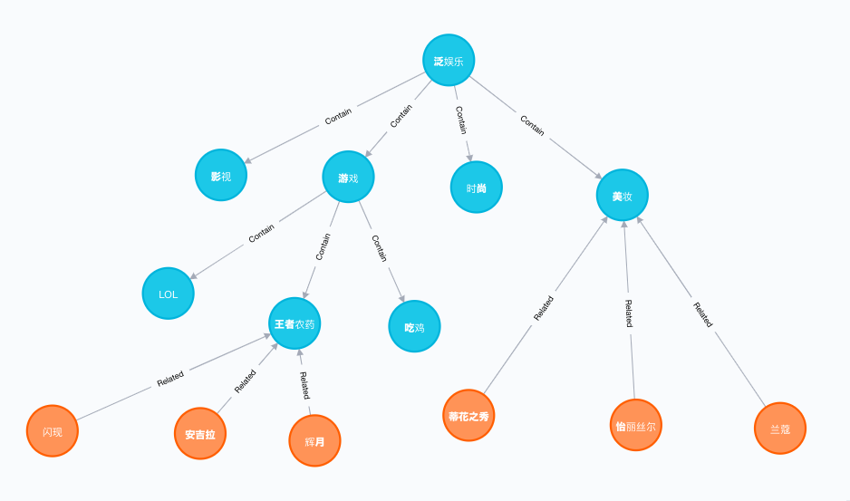
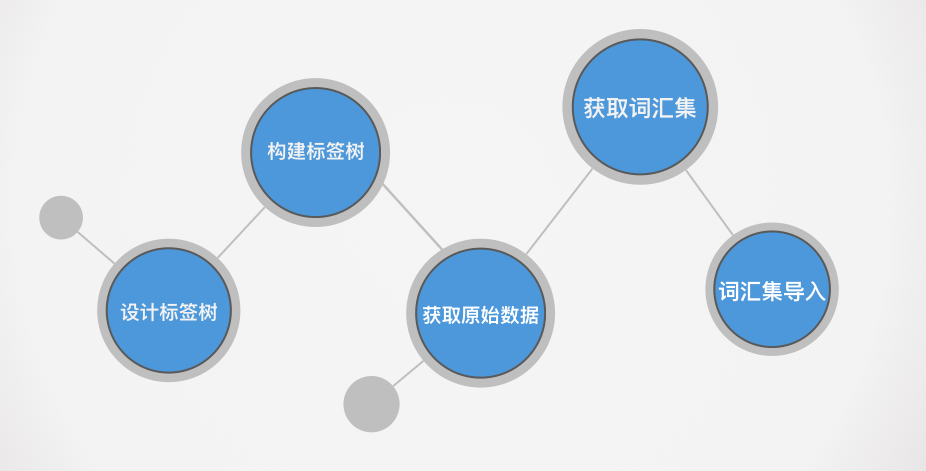
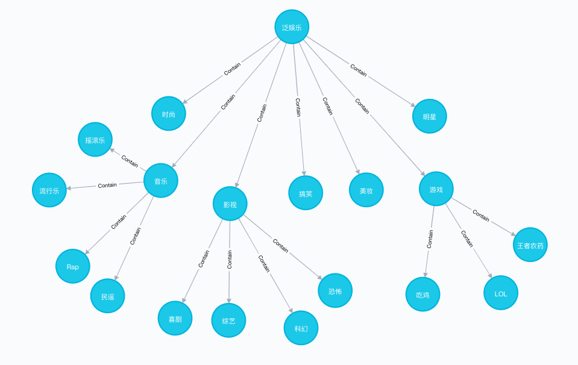
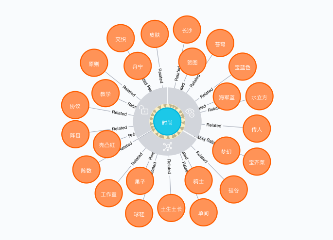

# 第二章:构建标签词汇图谱

## 本章导学

- 学习目标:
  - 使用图数据库neo4j构建起标签词汇图谱,用于基于词汇的标签匹配工作.

------

- 引导分析:



- 图中的蓝色节点代表标签,因为给文本打上什么标签是和业务紧密相连的，因此它是我们根据业务设计的，设计完成后，我们使用图数据库语言cypher在图数据库中构建它.

------

- 图中的橘色节点代表词汇,词汇一般是指与连接标签相关的名词，这些名词来自于所谓的原始数据，我们这里的原始是由公司内部的人员提供的.在有了原始数据后，我们便可以从中进行获取词汇集，最后将词汇集导入图谱。

------

------

- 构建标签词汇图谱的五个步骤:



------

- 本章小节:
  - 2.1 设计标签树
    - 学习设计一颗和业务有很大的关联的标签树, 应遵循一些设计原则, 保证标签树的合理性.
  - 2.2 构建标签树
    - 学习根据设计的标签树,在neo4j中存储这个结构.
  - 2.3 获取原始数据
    - 学习原始数据有关的内容,让大家我对我们的数据有深刻的理解.
  - 2.4 获取词汇集
    - 学习根据原始数据, 进行一些抽取工作, 获得准备导入图谱的词汇集.
  - 2.5 将词汇集导入图谱
    - 学习根据获得的词汇集,使用cypher语句将词汇导入到图谱当中.

------

------

------

## 2.1 设计标签树

- 学习目标:
  - 了解设计标签树的原因.
  - 掌握设计标签树过程的三步曲.

------

------

- 设计标签树的原因:
  - 根据业务需求, 对文本分类的目标进行明确, 保证分类结果对业务有益.

------

- 设计标签树过程的三步曲:
  - 第一步: 明确设计原则.
  - 第二步: 确定一级和二级标签.
  - 第三步: 标签树存储.

------

- 第一步: 明确设计原则:
  - 业务导向原则: 就是说标签设计必须与公司业务强相关, 明确产品长期稳定需求, 尽量减少标签变动,这需要我们去了解自己公司的产品，不要一味去追求大而全.
  - 最小可行化原则: 要记住我们的标签体系就像模型一样,是不断迭代的，所以初期设计要遵循最小可行化.

------

- 第二步: 确定一级和二级标签:


```
# 一级标签:
{"泛娱乐": ["明星", "美妆", "时尚", "影视", "音乐", "游戏", "美食"]}

# 二级标签:
{
    "游戏":[
        "LOL",
        "王者农药",
        "吃鸡"
    ],
    "影视":[
        "喜剧",
        "综艺",
        "科幻",
        "恐怖"
    ],
    "音乐":[
        "摇滚乐",
        "民谣",
        "Rap",
        "流行乐"
    ]
} 
```

------

- 第三步: 标签存储:


```
# 必须使用扁平化的存储结构:
LABEL_STRUCTURE = [
    {
        "泛娱乐":[
            "明星",
            "时尚",
            "游戏",
            "影视",
            "音乐",
            "美妆"
        ]
    },
    {
        "游戏":[
            "LOL",
            "王者农药",
            "吃鸡"
        ],
        "影视":[
            "喜剧",
            "综艺",
            "科幻",
            "恐怖"
        ],
        "音乐":[
            "摇滚乐",
            "民谣",
            "Rap",
            "流行乐"
        ]
    }
]
```

- 将LABEL_STRUCTURE作为配置项写入到/data/django-uwsgi/text_labeled/settings.py之中.

------

- 小节总结:

  - 设计标签树的原因:
    - 根据业务需求, 对文本分类的目标进行明确, 保证分类结果对业务有益.

  ------

  - 学习了设计标签树过程的三步曲:
    - 第一步: 明确设计原则.
    - 第二步: 确定一级和二级标签.
    - 第三步: 标签树存储.

  ------

  - 学习了明确设计原则:
    - 业务导向原则
    - 最小可行化原则

  ------

  - 学习了确定一级和二级标签.

  ------

  - 学习了标签存储:
    - 必须使用扁平化的存储结构.
    - 并将该结构存储在配置文件中.

------

------

------

## 2.2 构建标签树

- 学习目标:
  - 掌握在图数据中构建标签树的四步曲.

------

- 构建标签树的四步曲:
  - 第一步: 删除数据库中之前的与标签相关的节点和边, 以免重复创建.
  - 第二步: 遍历标签结构列表(LABEL_STRUCTURE)中的每一个字典.
  - 第三步: 遍历字典中的每一组key和value,根据key, MERGE每一个等级的父标签节点.
  - 第四步: 遍历value列表,创建每一个等级的子标签节点及其关系.

------

- 标签结构列表:


```
LABEL_STRUCTURE = [
    {
        "泛娱乐":[
            "明星",
            "时尚",
            "游戏",
            "影视",
            "音乐",
            "美妆"
        ]
    },
    {
        "游戏":[
            "LOL",
            "王者农药",
            "吃鸡"
        ],
        "影视":[
            "喜剧",
            "综艺",
            "科幻",
            "恐怖"
        ],
        "音乐":[
            "摇滚乐",
            "民谣",
            "Rap",
            "流行乐"
        ]
    }
]
```

------

- 构建标签树的代码分析:


```
# 因为我们需要导入settings.py中的配置信息
# 所以需要将上一级路径导入到系统路径中
import sys
sys.path.append('../')
from neo4j.v1 import GraphDatabase
from settings import NEO4J_CONFIG, LABEL_STRUCTURE

def create_label_node_and_rel():
    """该函数用于创建标签树的节点和边"""
    _driver = GraphDatabase.driver(**NEO4J_CONFIG)
    with _driver.session() as session:
        # 删除所有Label节点以及相关联的边
        cypher = "MATCH(a:Label) DETACH DELETE a"
        session.run(cypher)
        def _create_node_rel(l: dict):
            """根据标签树结构中的每一个字典去创建节点和关系"""
            if not l: return
            # 遍历字典中的k,v即父子标签
            for k, v in l.items():
                # MERGE一个父标签节点
                cypher = "MERGE(a:Label{title:%r})" % (k)
                session.run(cypher)

                def __c(word):
                    """用于创建子标签节点以及与父标签之间的关系"""
                    cypher = "CREATE(a:Label{title:%r}) \
                              SET a.name=%r WITH a \ 
                              MATCH(b:Label{title:%r}) \ 
                              MERGE(b)-[r:Contain]-(a)" % (word, word, k)
                    session.run(cypher)
                # 遍历子标签列表
                list(map(__c, v))
        # 遍历标签树列表
        list(map(_create_node_rel, LABEL_STRUCTURE))
```

------

- 代码位置: 代码将写在/data/django-uwsgi/text_labeled/create_graph/build.py中.

------

- 输入实例:


```
读取配置的标签结构列表LABEL_STRUCTURE
```

------

- 输出效果:
  - 在neo4j可视化页面中查看: http://0.0.0.0:7474



------

- 主要注释:


```
# 因为我们需要导入settings.py中的配置信息
# 所以需要将上一级路径导入到系统路径中

"""该函数用于创建标签树的节点和边"""

# 删除所有Label节点以及相关联的边

"""根据标签树结构中的每一个字典去创建节点和关系"""

# 遍历字典中的k,v即父子标签

# MERGE一个父标签节点

"""用于创建子标签节点以及与父标签之间的关系"""

# 遍历子标签列表

# 遍历标签树列表
```

------

------

- 小节总结:
  - 学习并实现了构建标签树的四步曲:
    - 第一步: 删除数据库中之前的与标签相关的节点和边, 以免重复创建.
    - 第二步: 遍历标签结构列表(LABEL_STRUCTURE)中的每一个字典.
    - 第三步: 遍历字典中的每一组key和value,根据key, MERGE每一个等级的父标签节点.
    - 第四步: 遍历value列表,创建每一个等级的子标签节点及其关系.

------

------

------

## 2.3 获取原始数据

- 学习目标:
  - 了解原始数据的来源及其样式.
  - 掌握原始数据的基本属性.

------

- 原始数据来源:
  - 公司作为内容生产商,有各种类型内容的生产小组，提供各种文本语料.

------

- 原始数据样式:


```
# 明星

玩笑归玩笑，谈到录制感受和评选标准时，沈腾自爆自己是最心软的观察员，给的yes最多，“可能是年纪大了，特别容易被选手感染，之前一个歌手刚开口，我就忍不住想哭”。
相对而言，金星算是比较严格的梦想观察员，她心目中的“达人”要在自己的普通生活之外，有着与众不同且足够极致的长处，“我对每个节目有40秒的忍耐期，如果在这之后没有打动我的东西，我就会按no。”
作为团内最年轻的成员，活泼的杨幂表现出了鲜明的“团宠属性”。不仅亲切地称呼沈腾为“二舅”、金星为“金姨”，还和口中的“我哥”蔡国庆共享暗号。节目录制下来，杨幂谦虚表示，自己在《达人秀》的舞台上见识了很多震撼的表演，是一次长见识的旅程。至于评判标准，杨幂坦言，自己对于一些专业表演没有太多见解，主要尊崇内心做选择。
```


```
# 时尚

采访中她曾提到希望大家包容她善待她，不管是她饰演的角色还是她本人。她为角色发声，为校园霸凌发声，同样为自己发声，希望观众对于她这个新人演员，能在给予严格的要求同时更给予情感的包容。而面对一些diss和嘲讽她的言语，她也表示不会因此而改变，而是会选择坚持自我，不忘初心，做自己。她曾说过“人生本无意义，人的存在就是为了创造意义。”年龄虽小，却是个有主见有自我坚持的女孩。
坚定如初
上衣：Hollister
裤子：Hollister
鞋：Mizuno
耳环：Inch Edition
耳夹：Thing In Thing
青春少女持刀出行，刀韧锋利却不敌她眼中的坚定与炙热。让我们看到了一个不到20岁的少女超出常人的成熟，和年轻充满活力的小性感。
粉色套装：Isabel Marant
鞋子：Stuart Weitzman
耳环：Atelier Swarovski
```


```
# 影视

电影有无限的可能性，原声音乐也能给电影创作提供灵感，电影和音乐的关系是开放的。为发出这样的讯号，FIRST影展今年与MOO音乐携手合作，在电影节期间提供了一个电影和音乐交叉的场景。
MOO音乐隶属于腾讯音乐娱乐集团，创立以来受到不少深度音乐爱好者的青睐。以天然的曲库优势为依托，MOO音乐致力于融合先锋与经典，拓展当代流行音乐的边界，为用户提供纯粹的沉浸式音乐体验，致力于成为一个引领当代青年人发现、探索新鲜流行乐的新一代潮流音乐APP。
作为FIRST影展音乐平台合作伙伴，MOO音乐赞助了场外奖“先锋音乐突破奖”，这也是FIRST首次设立电影音乐方向的专项奖。为《春潮》配乐的音乐人半野喜弘获得了这一奖项，MOO音乐产品负责人王宝华为他颁奖，称赞“这是先锋的音乐”。
半野喜弘的作品经常出现在侯孝贤和贾樟柯导演的电影里，《戏梦人生》《海上花》《山河故人》中的配乐都体现了他成熟的音乐思维和对影像独立、立体的理解。《春潮》导演杨荔钠曾这样描述他们的创作过程：“他隔空对话，视频传送，反覆修改你的旋律，《春梦》《春潮》都留有他谱写的乐章。”《春潮》同时将在宣发阶段得到MOO和QQ音乐的推广资源，等待早日与观众见面。
```


```
# 美妆

怡丽丝尔优悦活颜眼唇抚纹精华霜睛采上市
9周淡纹,眼证为实，新一线女性生活真相代表papi酱带你一同见证
 2018年5月10日,怡丽丝尔于北京虞社演艺空间举办全新优悦活颜眼唇抚纹精华霜新品发布会.品牌总监上田典史先生亲临现场，更携手知名原创视频达人papi酱作为特邀真相见证人，揭晓《新一线女性生活真相》白皮书，盛邀来自全国各地的主流时尚美妆媒体、众多知名美妆博主及护肤达人共同加入“9周淡纹，眼证为实”的见证人行列中来。
首先映入眼帘的是一个数字“9”造型的通道,置身其中，一条条关于护肤的“真相”弹幕袭来：“中年少女选购护肤品有多挑剔”、“猜猜你的衰老临界点在几点”等问题让来宾会心一笑的同时，亦引发了护肤真相的诸多思考.怡丽丝尔始终致力于亚洲女性之美，本次联合中国领先的社会化商业资讯提供机构Kantar Media CIC，将多年来对中国女性的关注汇聚为一本独具见解与洞察力的《新一线女性生活真相》白皮书，通过大数据破解新一线女性的皱纹秘密，从社会热点、生活方式和护肤习惯三个方面唤起大家对皱纹的认知及重视。
怡丽丝尔品牌总监上田典史先生表示： “自2017年在中国开展品牌革新以来,怡丽丝尔从未停下脚步，不断向前.我们始终关注亚洲女性之美，致力于为消费者提供持续创新的产品和价值体验。在这样的品牌愿景下，怡丽丝尔将目光聚焦于当下中国新一线女性的生活。我们发现尽管大部分中国女性十分注重抗老化问题，但却普遍认为护肤产品效果不尽人意。为满足广大中国消费者对于抚纹的护肤诉求，此次全新推出了功效认证的怡丽丝尔优悦活颜眼唇抚纹精华霜，不仅是品牌价值的有力证明，更标志着怡丽丝尔又一次的创新与突破。我们期待这款产品让更多中国女性绽放自信与健康的光芒，成就积极向上与自信坚强的魅力人生，遇见更好的自己。 “
```

------

- 原始数据的基本属性:
  - 文章为短文,在几百至几千字不等.
  - 内容围绕明确的主题展开,其中涉猎很多相关命名实体.
  - 完整句子使用句号分割,小段使用换行符分割.

------

- 原始语料存放的位置:
  - 存放在/data/django-uwsgi/text_labeled/create_graph/目录下.

------

------

- 小节总结:

  - 学习了原始数据来源:
    - 公司作为内容生产商,有各种类型内容的生产小组，提供各种文本语料.

  ------

  - 学习了原始数据样式.

  ------

  - 学习了原始数据的基本属性:
    - 文章为短文,在几百至几千字不等.
    - 内容围绕明确的主题展开,其中涉猎很多相关命名实体.
    - 完整句子使用句号分割,小段使用换行符分割.

------

------

------

## 2.4 获取词汇集

- 学习目标:
  - 掌握获取词汇集过程的三步曲.

------

- 获取词汇集过程的三步曲:
  - 第一步: 读取原始数据到内存.
  - 第二步: 获取句子中的名词并进行长度过滤.
  - 第三步: 将词汇写入到csv文件和userdict.txt之中.

------

- 获取词汇集过程的代码分析:


```
import os
import jieba

# 使用jieba中的词性标注功能
import jieba.posseg as pseg

# jieba中预定义的名词性类型,分别表示: 人名，名词，地名，机构团体名，其他专有名词
n_e = ["nr", "n", "ns", "nt", "nz"]

# 写入csv的路径
csv_path = "./labels"

# 用户自定义词典路径
userdict_path = "../userdict.txt"

def get_vocabulary(article_path, csv_name):
    """函数将读取文章路径下的所有文章文本,并转化为词汇写入词汇csv文件"""
    if not os.path.exists(article_path): return
    if not os.path.exists(csv_path): os.mkdir(csv_path)
    def _get_n_list(text):
        """用于获取名词列表"""
        # 使用jieba的词性标注方法切分文本,获得具有词性属性flag和词汇属性word的对象, 
        # 从而判断flag是否在我们定义的名词性列表中,来返回对应的词汇
        r = []
        for g in pseg.lcut(text):
            if g.flag in n_e:
                r.append(g.word)
        return r

    with open(os.path.join(csv_path, csv_name), "a") as u:
        for article in os.listdir(article_path):
            with open(os.path.join(article_path, article), "r") as f:
                text = f.read()
            # 只获取长度大于等于2的名词
            n_list = list(filter(lambda x: len(x)>=2, set(_get_n_list(text))))
            list(map(lambda x: u.write(x + "\n"), n_list))

    with open(os.path.join(csv_path, csv_name), "r") as o:
        word = o.read()
        with open(userdict_path, "a") as f:
            f.write(word)
    return
```

------

- 代码位置: 代码将写在/data/django-uwsgi/text_labeled/create_graph/get_vocab.py中.

------

- 输入实例:


```
# 原始文章路径
article_path = "./fashion"

# 生成的csv文件名字(该文件在./labels目录下)
csv_name = "时尚.csv"
```

- 输出效果:


```
# 时尚.csv

福利
心情
张扬
腰身
T恤
闲暇
增色
美颜
上海
全身
个人
造型
时刻
印象派
蓝色
靴子
```

------

- 主要注释:


```
# 使用jieba中的词性标注功能

# jieba中预定义的名词性类型,分别表示: 人名，名词，地名，机构团体名，其他专有名词

# 写入csv的路径

# 用户自定义词典路径

"""函数将读取path路径下的所有文章文本,并转化为词汇写入词汇csv文件"""

"""用于获取名词列表"""

# 使用jieba的词性标注方法切分文本,获得具有词性属性flag和词汇属性word的对象, 
# 从而判断flag是否在我们定义的名词性列表中,来返回对应的词汇

# 只获取长度大于等于2的名词
```

------

------

- 小节总结:
  - 学习并实现了获取词汇集过程的三步曲:
    - 第一步: 读取原始数据到内存.
    - 第二步: 获取句子中的名词并进行长度过滤.
    - 第三步: 将词汇写入到csv文件和userdict.txt之中.

------

------

------

## 2.5 将词汇集导入图谱

- 学习目标:
  - 掌握实现将词汇集导入图谱过程的三步曲.

------

- 将词汇集导入图谱过程三步曲:
  - 第一步: 删除所有词汇节点及其相关的边
  - 第二步: 遍历labels文件夹下的词汇csv文件.
  - 第三步: 遍历csv文件中的每一个词汇去创建节点，并与对应的标签建立关系.

------

- 将词汇集导入图谱过程的代码分析：


```
import os
import random
import fileinput

csv_path = "./labels"

def create_vocabulary_node_and_rel():
    """该函数用于创建词汇节点和关系""" 
    _driver = GraphDatabase.driver(**NEO4J_CONFIG)
    with _driver.session() as session:
        # 删除所有词汇节点及其相关的边
        cypher = "MATCH(a:Vocabulary) DETACH DELETE a"
        session.run(cypher)

        def _create_v_and_r(csv):
            """读取单个csv文件,并写入数据库创建节点并与对应的标签建立关系"""
            path = os.path.join(csv_path, csv)
            # 使用fileinput的FileInput方法从持久化文件中读取数据,
            # 并进行strip()操作去掉两侧空白符, 再通过set来去重.
            word_list = list(
                set(map(lambda x: x.strip(), fileinput.FileInput(path))))

            def __create_node(word):
                """创建csv中单个词汇的节点和关系"""
                # 定义词汇的初始化权重,即词汇属于某个标签的初始概率，
                # 因为词汇本身来自该类型文章，因此初始概率定义在0.5-1之间的随机数
                weight = round(random.uniform(0.5, 1), 3)
                # 使用cypher语句创建词汇节点,然后匹配这个csv文件名字至后四位即类别名，
                # 在两者之间MERGE一条有权重的边
                cypher = "CREATE(a:Vocabulary{name:%r}) WITH a \
                          MATCH(b:Label{title:%r}) \
                          MERGE(a)-[r:Related{weight:%f}]-(b)" % (word, csv[:-4], weight)
                session.run(cypher)
            # 遍历词汇列表
            list(map(__create_node, word_list))
        # 遍历标签列表
        label_list = os.listdir(csv_path)
        list(map(_create_v_and_r, label_list))
```

------

- 代码位置: 代码将写在/data/django-uwsgi/text_labeled/create_graph/build.py中.

------

- 输入实例:


```
# 词汇集csv文件路径
csv_path = "./labels"
```

------

- 输出效果: 

------

- 主要注释:


```
"""该函数用于创建词汇节点和关系"""

# 删除所有词汇节点及其相关的边

"""读取单个csv文件,并写入数据库创建节点并与对应的标签建立关系"""

# 使用fileinput的FileInput方法从持久化文件中读取数据,
# 并进行strip()操作去掉两侧空白符, 再通过set来去重.

"""创建csv中单个词汇的节点和关系"""

# 定义词汇的初始化权重,即词汇属于某个标签的初始概率，
# 因为词汇本身来自该类型文章，因此初始概率定义在0.5-1之间的随机数

# 使用cypher语句创建词汇节点,然后匹配这个csv文件名字至后四位即类别名，
# 在两者之间MERGE一条有权重的边

# 遍历词汇列表

# 遍历标签列表
```

------

------

- 小节总结:
  - 学习并实现了将词汇集导入图谱过程三步曲:
    - 第一步: 删除所有词汇节点及其相关的边
    - 第二步: 遍历labels文件夹下的词汇csv文件.
    - 第三步: 遍历csv文件中的每一个词汇创建节点，并与对应的标签建立关系.

------

## 本章总结

- 第1小节: 设计标签树

  - 学习了设计标签树过程的三步曲:

    - 第一步: 明确设计原则.
    - 第二步: 确定一级和二级标签.
    - 第三步: 标签树存储.

    ------

    - 学习了明确设计原则:
    - 业务导向原则
    - 最小可行化原则

    ------

    - 学习了确定一级和二级标签.

    ------

    - 学习了标签存储:
    - 必须使用扁平化的存储结构.

------

- 第2小节: 构建标签树
  - 学习并实现了构建标签树的四步曲:
    - 第一步: 删除之前的与标签相关的节点和边.
    - 第二步: 遍历标签结构列表中的每一个字典.
    - 第三步: 遍历字典中的每一组key和value,根据key，MERGE每一个等级的父标签节点.
    - 第四步: 遍历value列表,创建每一个等级的子标签节点及其关系.

------

- 第3小节: 获取原始数据

  - 学习了原始数据来源:
    - 公司作为内容生产商,有各种类型内容的生产小组，提供各种文本语料.

  ------

  - 学习了原始数据样式.

    ------

  - 学习了原始数据的基本属性.

------

- 第4小节: 获取词汇集
  - 学习并实现了获取词汇集过程的三步曲:
    - 第一步: 读取原始数据到内存.
    - 第二步: 获取句子中的名词并进行长度过滤.
    - 第三步: 将词汇写入到csv文件之中.

------

- 第5小节: 将词汇集导入图谱
  - 学习并实现了将词汇集导入图谱过程三步曲:
    - 第一步,删除所有与词汇节点及其相关的边
    - 第二步,遍历labels文件夹下的词汇csv文件.
    - 第三步,遍历csv文件中的每一个词汇创建节点, 并与对应的标签建立关系.