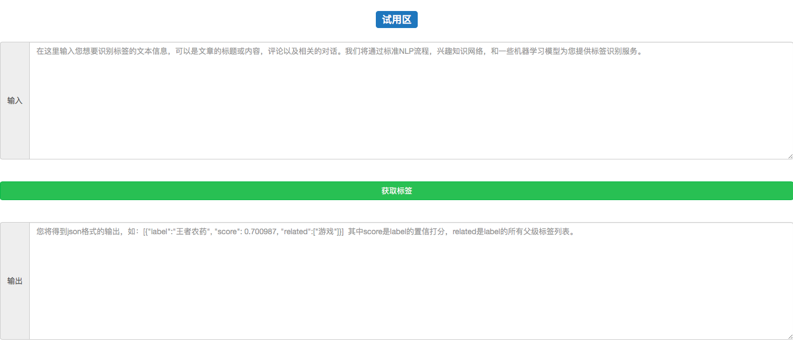
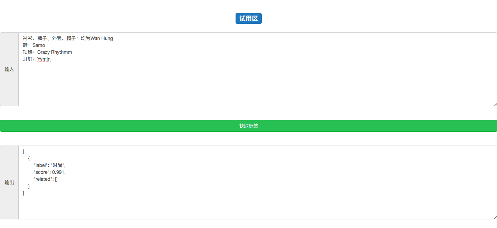

# 第五章:系统联调与测试

## 本章导学

- 学习目标:
  - 完成系统的各个环节的联调，使其成为一个完整可运行的后端服务。
  - 搭建一个前端页面，使其能够与后端系统进行交互。

------

- 引导分析:
  - 必须完成系统各个环节的联调工作，才能使其正常运行和对外提供服务。
  - 一个完整的前端可视化页面能够帮助我们更好的展示自己作品效果。

------

- 本章小节:
  - 5.1 系统联调与测试
    - 将整个后端服务的各个部分连接起来, 能够正常对外提供服务.
  - 5.2 前端可视化页面的搭建
    - 搭建一个前端页面能够请求后端服务.

------

------

------

## 5.1 系统联调与测试

- 学习目标:
  - 掌握实现系统联调与测试过程的三步曲。

------

- 系统联调与测试过程的三步曲:
  - 第一步: 明确系统处理请求的五个环节.
  - 第二步: 将这五个环节实现在django服务的views.py函数中.
  - 第三步: 使用测试脚本进行测试.

------

- 明确系统处理请求的五个环节:
  - 输入预处理
    - 对输入的文本做长度验证, 分词, 去停用词等处理操作.
  - 图谱匹配
    - 使用输入文本中的词汇进入到图谱中进行匹配, 找出所有可能的标签.
  - 匹配歧义判断
    - 使用模型对所有不确定的标签进行判断, 找出最合适的标签.
  - 概率调整
    - 调整标签的概率, 满足随着相关词汇增多, 概率逐渐增大
  - 概率归一化与父标签检索
    - 对概率进行归一化处理, 并检索匹配标签的父级标签列表.

------

- 将这五个环节实现在django服务的views.py函数中过程的代码分析:


```
from django.http import HttpResponse
from rest_framework import viewsets
from rest_framework.response import Response
from rest_framework.decorators import api_view
from rest_framework.permissions import IsAuthenticated
from rest_framework.decorators import authentication_classes
from rest_framework.decorators import permission_classes
import json


# 从text_labeled导入api文件
from text_labeled import api


# 接收POST类型的请求
@api_view(['POST'])
def get_label(request):
    # 接收POST请求，并取数据中的"text"对应的值
    text = request.POST.get("text")
    # 开始调用text_labeled目录下的api.py中的函数:
    # 调用输入预处理  
    word_list = api.handle_cn_text(text)
    # 调用图谱匹配
    index_map_label = api.get_index_map_label(word_list)
    # 调用匹配歧义判断
    index_map_label_ = api.weight_update(word_list, index_map_label)
    if index_map_label_:
        # 调用概率调整
        df_ = api.control_increase(index_map_label_)
        # 调用概率归一化与父标签检索
        result = api.father_label_and_normalized(df_)
    else:
        result = []

    # 然后封装成响应体返回结果
    return HttpResponse(json.dumps(result, ensure_ascii=False))
```

------

- 代码位置: 代码将写在/data/django-uwsgi/api/views.py中。

------

- 文件路径调整:


```
# 在/data/django-uwsgi/text_labeled/api.py中添加系统路径识别
import sys
sys.path.append("/data/django-uwsgi/text_labeled/")

# 在/data/django-uwsgi/text_labeled/model_train/multithread_predict.py
import sys
sys.path.append("/data/django-uwsgi/text_labeled/model_train/") 
```

------

- 主要注释:


```
    # 接收POST请求，并取数据中的"text"对应的值
    # 开始调用text_labeled目录下的api.py中的函数:
    # 调用输入预处理
    # 调用图谱匹配
    # 调用匹配歧义判断
    # 调用概率调整
    # 调用概率归一化与父标签检索
    # 然后封装成响应体返回结果
```

- 使用测试脚本进行测试:


```
# 修改test.py文件中的输入内容:
将输入文本改为:
{"text": "衬衫、裤子、外套、帽子：均为Wan Hung, 鞋：Samo, 项链：Crazy Rhythmm, 耳钉：Yvmin!"}
```

------

- 代码位置: 代码写在/data/django-uwsgi/test.py中.

------


```
# 重启服务 
supervisorctl restart all

# 运行测试脚本
python test.py
```

------

- 代码位置: 代码在终端中运行, 写在/data/django-uwsgi/目录下.

------

- 输出效果:


```
# 最终的结果样式
[{"label": "时尚", "score": 0.991, "related": []}]
```

------

------

- 小节总结:

  - 学习并实现系统联调与测试过程的三步曲:
    - 第一步: 明确系统处理请求的五个环节。
    - 第二步: 将这五个环节实现在django服务的views.py函数中。
    - 第三步: 使用测试脚本进行测试。

  ------

  - 明确系统处理请求的五个环节:
    - 输入预处理
      - 对输入的文本做长度验证, 分词, 去停用词等处理操作.
    - 图谱匹配
      - 使用输入文本中的词汇进入到图谱中进行匹配, 找出所有可能的标签.
    - 匹配歧义判断
      - 使用模型对所有不确定的标签进行判断, 找出最合适的标签.
    - 概率调整
      - 调整标签的概率, 满足随着相关词汇增多, 概率逐渐增大
    - 概率归一化与父标签检索
      - 对概率进行归一化处理, 并检索匹配标签的父级标签列表.

  ------

  - 将这五个环节实现在django服务的views.py函数中:
    - 函数: get_label

  ------

  - 使用测试脚本进行测试:
    - 文件路径调整
    - 重启服务
    - 运行脚本test.py

------

------

------

## 5.2 搭建前端可视化页面

- 学习目标:
  - 掌握搭建一个与后端交互的前端可视化页面的三步曲。

------

- 搭建一个前端可视化页面的三步曲:
  - 第一步: 使用bootstrap3搭建一个html页面。
  - 第二步: 使用jquery向后端发送ajax请求并显示结果。
  - 第三步: 在页面中输入文本进行请求测试。

------

- 使用bootstrap3搭建一个html页面的代码分析:


```
<!DOCTYPE html>
<html lang="zh-CN">

<meta http-equiv="Content-Type" content="text/html; charset=utf-8" /> 

<!— 导入bootstrap3 css部分用于文本输入框按钮等控件的美化。—>
<link href="./bootstrap-3.3.7-dist/css/bootstrap.min.css" rel="stylesheet">

<!-- 导入jquery用于发送ajax请求-->
<script src="./js/jquery-2.1.1.min.js"></script>

<!-- 导入bootstrap3 js部分用于控件中的效果-->
<script src="./bootstrap-3.3.7-dist/js/bootstrap.min.js"></script>

 <!-- 导入我们自己的js部分用于控件中的效果-->
<script type="text/javascript" src="./js/try.js"></script>

<script type="text/javascript">$(init);</script>

<script type="text/javascript">$.ajaxSetup({
    data: {csrfmiddlewaretoken: '6tuXkYOS6uhRbDX1BSC2wbZ5d3Js9DKpdBf9v3NlSfS8qXVI0BtGWH3LAV7AX98E' },});</script>


<!-- 等待图标 -->

<div id="loading">
    <p></p>
</div>


<!-- 图标样式 -->
<style>
#loading{ display:none;
          position:fixed;
          left:47%;
          top:68%;
          z-index: 99;}
</style>

<hr/>


<!-- 试用区的标题 -->
<h3  align="center"><span class="label label-primary"> 试用区</span></h3>

<br>


<!-- 输入文本框 -->
<div>
    <form class="bs-example bs-example-form" role="form">
        <div class="input-group">
            <span class="input-group-addon">输入</span>
            <textarea id="text-content" class="form-control" placeholder="在这里输入您想要识别标签的文本信息，可以是文章的标题或内容，评论以及相关的对话。我们将通过标准NLP流程，兴趣知识网络，和一些机器学习模型为您提供标签识别服务。" rows="10" cols="80"></textarea>
        </div>
        <br><br>

<!-- 请求按钮 -->
 <div class="button-div">
           <button type="button" class="btn  btn-success btn-block" id="label-button">获取标签</button>
      </div>
      <br><br>


<!-- 输出文本框 -->  
        <div class="input-group">
            <span class="input-group-addon">输出</span>
            <textarea id="label-result" class="form-control" type="text" placeholder='您将得到json格式的输出，如：[{"label":"王者农药", "score": 0.700987, "related":["游戏"]}]  其中score是label的置信打分，related是label的所有父级标签列表。' rows="10" cols="80"></textarea>
        </div>
    </form>
</div>

<br/>

</html>
```

------

- 代码位置: 代码将写在/data/django-uwsgi/text_labeled/html/index.html中。

------

- 查看地址: http://47.92.175.143:8087/text_labeled/html/index.html

------

- 输出效果:



------

- 使用jquery向后端发送ajax请求并显示结果过程的代码分析:


```
////////展示loading图标//////////
function showLoading() {
    $("#loading").show();
}


////////隐藏loading图标//////////
function hideLoading() {
    $("#loading").hide();
}


function init(){
    $("#label-button").click(function(){
          label_processing();
       });
   }


////////发送试用请求//////////
function label_processing(){
        showLoading();
        var content = $("#text-content").val();
        $.ajax({ type:"POST",
          url:"http://47.92.175.143:8087/api/get_label/",
          data: {"text":content,},
          success:function(result){
          var obj = JSON.parse(result);
          var pretty = JSON.stringify(obj, undefined, 4);
          $("#label-result").val(pretty);
          hideLoading();}
               });         }
```

- 代码位置: 代码将写在/data/django-uwsgi/text_labeled/html/js/index.js中。

------

- 输入文本:


```
衬衫、裤子、外套、帽子：均为Wan Hung, 
鞋：Samo, 
项链：Crazy Rhythmm, 
耳钉：Yvmin!
```

------

- 最终效果演示:



------

- 小节总结:
  - 学习并实现了搭建一个前端可视化页面的三步曲:
    - 第一步：使用bootstrap3搭建一个html页面。
    - 第二步：使用jquery向后端发送ajax请求并显示结果。
    - 第三步: 在页面中输入文本进行请求测试。

------

## 本章总结

- 第一小节: 系统联调与测试

  - 学习并实现系统联调与测试过程的三步曲:
    - 第一步: 明确系统处理请求的五个环节。
    - 第二步: 将这五个环节实现在django服务的views.py函数中。
    - 第三步: 使用测试脚本进行测试。

  ------

  - 学习了明确系统处理请求的五个环节:
    - 输入预处理
    - 图谱匹配
    - 匹配歧义判断
    - 概率调整
    - 概率标签化与父标签检索

------

- 第二小节: 搭建前端可视化页面
  - 学习并实现了搭建一个前端可视化页面的三步曲:
    - 第一步：使用bootstrap3搭建一个可视化页面。
    - 第二步：使用jquery向后端发送ajax请求并显示结果。
    - 第三步: 在页面中输入文本进行请求测试。